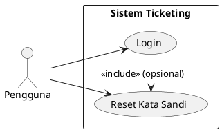
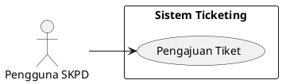
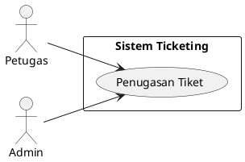
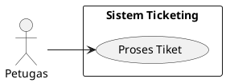
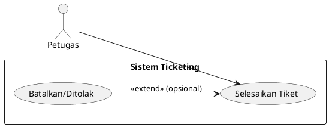
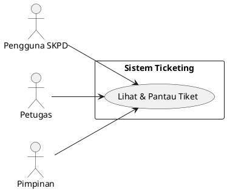
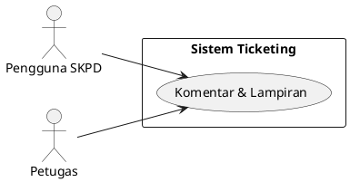
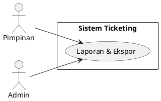
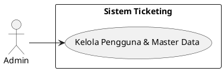
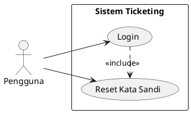

# BAB II

# ANALISIS KEBUTUHAN SISTEM

## 2.1 Pendahuluan

Sistem Ticketing Layanan Kominfo Kota Bukittinggi adalah aplikasi web internal untuk mencatat, mengelola, dan melaporkan permintaan bantuan teknis dari SKPD. Tujuannya adalah menyediakan proses yang terstandar, transparan, dan terukur dari pengajuan hingga penyelesaian pekerjaan, sekaligus menyajikan data beban kerja bagi pimpinan.

Ruang lingkup pada tahap awal (MVP) mencakup pengelolaan tiket end-to-end, peran pengguna (`SKPD`, `Petugas Kominfo`, `Admin`, `Pimpinan`), notifikasi email dasar, serta pelaporan ringkas. Integrasi lanjutan (SSO, WA/SMS, otomasi eskalasi penuh) direncanakan di fase berikutnya.

## 2.2 Kebutuhan Fungsional (Detail)

- Autentikasi & Otorisasi
	- Login berbasis akun internal; reset kata sandi via email.
	- Role-based access control: `SKPD`, `Petugas`, `Admin`, `Pimpinan`.
	- Manajemen sesi dan logout aman.

- Manajemen Pengguna & SKPD (Admin)
	- CRUD pengguna: buat, ubah, nonaktifkan, reset kata sandi.
	- Penetapan peran dan asosiasi ke SKPD (untuk pengguna SKPD).
	- CRUD data master SKPD dan struktur unit kerja.

- Manajemen Data Master (Admin)
	- CRUD jenis pekerjaan/kategori, prioritas, dan label/tag.
	- Pengaturan status tiket yang diizinkan dan transisinya (workflow sederhana).
	- Pengaturan SLA dasar per kategori/prioritas (opsional di MVP).

- Tiket Pekerjaan (SKPD, Petugas)
	- Pembuatan tiket oleh SKPD dengan field minimal:
		- Judul, deskripsi rinci, kategori/jenis pekerjaan, prioritas, SKPD pemohon (auto), lampiran (opsional), kontak/pic.
	- Penomoran tiket otomatis dan unik (format: tahun-bulan-sekuens).
	- Validasi isian wajib dan ukuran/jenis berkas lampiran.
	- Penugasan tiket ke petugas/tipe tim oleh Petugas/Admin.
	- Perubahan status: `Baru` → `Diproses` → `Selesai` (dengan opsi `Ditolak/Dibatalkan`).
	- Pencatatan progres: komentar, catatan teknis, dan riwayat aktivitas.
	- Penutupan tiket dengan ringkasan hasil/solusi dan waktu selesai.

- Notifikasi
	- Email notifikasi saat: tiket dibuat, diassign, status berubah, dan ditutup.
	- Preferensi notifikasi per pengguna (opsional di MVP).

- Pencarian, Filter, dan Sortir
	- Pencarian teks pada judul/nomor tiket.
	- Filter berdasarkan status, kategori, prioritas, tanggal, SKPD, petugas.
	- Sortir berdasarkan tanggal dibuat, prioritas, tenggat, status.

- Dashboard & Pelaporan
	- Dashboard ringkas per peran: total tiket, status, tren periode.
	- Laporan berdasarkan periode, SKPD, kategori, status.
	- Ekspor laporan ke CSV/PDF.

- Audit & Keamanan Data
	- Audit log: siapa melakukan apa dan kapan pada tiket dan master data.
	- Pembatasan akses data sesuai peran (SKPD hanya melihat tiketnya, Petugas/Admin melihat semua).

- Admin Sistem
	- Pengaturan umum: email/SMTP, logo/nama instansi, preferensi tampilan.
	- Backup/restore basis data (prosedural, dapat berupa SOP di luar aplikasi).

Catatan workflow tiket (state & aturan transisi):
- State utama: `Baru`, `Diproses`, `Selesai`; state sampingan: `Ditolak`, `Dibatalkan`.
- Aturan contoh: hanya Petugas/Admin yang dapat mengubah `Baru` → `Diproses`; tiket `Selesai` hanya dapat dibuka ulang oleh Admin (opsional) dengan alasan.

## 2.3 Kebutuhan Non-Fungsional (Detail)

- Keamanan
	- HTTPS wajib; penyimpanan kata sandi dengan hashing yang kuat (bcrypt/argon2).
	- Validasi input dan proteksi CSRF/XSS/SQL Injection.
	- Kontrol akses berbasis peran pada backend dan UI.

- Kinerja
	- Waktu muat halaman daftar tiket ≤ 3 detik pada 2000 tiket terindeks.
	- Pencarian/filter merespon ≤ 2 detik untuk 10.000 entri dengan indeks yang tepat.

- Ketersediaan & Reliabilitas
	- Target ketersediaan jam kerja; pemulihan insiden ≤ 4 jam kerja.
	- Backup harian dan retensi minimal 30 hari.

- Skalabilitas
	- Mampu menampung pertumbuhan tiket dan pengguna 3–5× tanpa perubahan arsitektur mayor.

- Kemudahan Penggunaan & Aksesibilitas
	- Navigasi konsisten, form dengan validasi jelas, pesan error informatif.
	- Kontras warna dan ukuran font mengikuti pedoman aksesibilitas dasar.

- Maintainability & Observability
	- Struktur kode modular (Laravel), logging terstandar, konfigurasi via env.
	- Dokumentasi admin & SOP operasional tersedia.

- Kompatibilitas
	- Browser modern (Chrome, Edge, Firefox) versi 2 tahun terakhir.
	- Integrasi SMTP standar; DB MySQL/MariaDB.

## 2.4 Use Case Umum Sistem (Detail)

UC-01 Login
- Aktor: Semua pengguna
- Tujuan: Mengakses sistem sesuai peran
- Prasyarat: Akun aktif
- Alur Utama: Buka halaman login → masukkan kredensial → autentikasi → masuk dashboard peran
- Alternatif: Lupa kata sandi → permintaan reset via email
- Pascakondisi: Sesi aktif tercipta

UC-02 Pengajuan Tiket (SKPD)
- Aktor: Pengguna SKPD
- Tujuan: Membuat tiket baru
- Prasyarat: Login, SKPD terasosiasi
- Alur Utama: Buka formulir → isi judul, deskripsi, kategori, prioritas, lampiran → kirim → tiket tercatat (status Baru) → notifikasi terkirim
- Alternatif: Validasi gagal → tampilkan pesan; unggahan melampaui batas → tolak unggahan
- Pascakondisi: Tiket baru dengan nomor unik

UC-03 Penugasan Tiket
- Aktor: Petugas/Admin
- Tujuan: Menetapkan penanggung jawab
- Prasyarat: Tiket status Baru
- Alur Utama: Buka detail tiket → pilih petugas → simpan → notifikasi ke petugas
- Pascakondisi: Field penanggung jawab terisi

UC-04 Proses Tiket
- Aktor: Petugas
- Tujuan: Memulai/menandai pengerjaan
- Prasyarat: Tiket ter-assign
- Alur Utama: Ubah status ke Diproses → tambahkan catatan/progres → unggah bukti jika perlu
- Pascakondisi: Riwayat progres tercatat

UC-05 Selesaikan Tiket
- Aktor: Petugas
- Tujuan: Menutup tiket
- Prasyarat: Pekerjaan selesai
- Alur Utama: Isi ringkasan hasil → ubah status ke Selesai → notifikasi ke pemohon
- Alternatif: Batalkan/ Tolak dengan alasan → status Dibatalkan/Ditolak
- Pascakondisi: Tiket tertutup, waktu selesai tercatat

UC-06 Lihat & Pantau Tiket
- Aktor: SKPD, Petugas, Pimpinan
- Tujuan: Melihat daftar dan detail tiket
- Prasyarat: Login
- Alur Utama: Buka daftar → gunakan filter/sortir → buka detail → lihat riwayat
- Pascakondisi: Tidak ada perubahan data

UC-07 Komentar & Lampiran
- Aktor: SKPD, Petugas
- Tujuan: Komunikasi dan bukti kerja
- Prasyarat: Akses ke tiket
- Alur Utama: Tambah komentar/unggah lampiran → tersimpan di timeline
- Pascakondisi: Aktivitas tercatat di audit log

UC-08 Laporan & Ekspor
- Aktor: Pimpinan/Admin
- Tujuan: Mendapatkan rekap beban kerja
- Prasyarat: Data tersedia
- Alur Utama: Pilih periode/SKPD/kategori → lihat ringkasan → ekspor CSV/PDF
- Pascakondisi: Berkas laporan tersedia untuk unduh

UC-09 Kelola Pengguna & Master Data
- Aktor: Admin
- Tujuan: Menjaga data dan konfigurasi
- Alur Utama: CRUD pengguna, SKPD, kategori, prioritas; atur SMTP dan preferensi
- Pascakondisi: Konfigurasi tersimpan, berpengaruh ke sistem

UC-10 Reset Kata Sandi
- Aktor: Semua pengguna
- Tujuan: Memulihkan akses
- Alur Utama: Minta reset → email tautan reset → set kata sandi baru
- Pascakondisi: Kredensial baru aktif

### 2.4.1 Deskripsi Gambar Use Case per UC

UC-01 Login — Deskripsi Diagram
- Aktor: `Pengguna` (mewakili semua peran)
- Boundary: Sistem Ticketing
- Use case: Login; relasi asosiasi dari aktor ke use case
- Relasi tambahan: include opsional ke `Reset Kata Sandi`

UC-02 Pengajuan Tiket — Deskripsi Diagram
- Aktor: `Pengguna SKPD`
- Boundary: Sistem Ticketing
- Use case: Pengajuan Tiket (membuat tiket baru)
- Relasi: asosiasi aktor SKPD ke use case

UC-03 Penugasan Tiket — Deskripsi Diagram
- Aktor: `Petugas`, `Admin`
- Boundary: Sistem Ticketing
- Use case: Penugasan Tiket (menetapkan penanggung jawab)
- Relasi: asosiasi Petugas/Admin ke use case

UC-04 Proses Tiket — Deskripsi Diagram
- Aktor: `Petugas`
- Boundary: Sistem Ticketing
- Use case: Proses Tiket (ubah status ke Diproses, tambah progres)
- Relasi: asosiasi Petugas ke use case

UC-05 Selesaikan Tiket — Deskripsi Diagram
- Aktor: `Petugas`
- Boundary: Sistem Ticketing
- Use case: Selesaikan Tiket (tutup tiket, ringkas hasil)
- Relasi: asosiasi Petugas ke use case
- Catatan: extend ke `Batalkan/Ditolak` bila diperlukan

UC-06 Lihat & Pantau Tiket — Deskripsi Diagram
- Aktor: `SKPD`, `Petugas`, `Pimpinan`
- Boundary: Sistem Ticketing
- Use case: Lihat & Pantau Tiket (daftar/detail, filter/sortir)
- Relasi: asosiasi masing-masing aktor ke use case

UC-07 Komentar & Lampiran — Deskripsi Diagram
- Aktor: `SKPD`, `Petugas`
- Boundary: Sistem Ticketing
- Use case: Komentar & Lampiran (komunikasi pada tiket)
- Relasi: asosiasi aktor ke use case

UC-08 Laporan & Ekspor — Deskripsi Diagram
- Aktor: `Pimpinan`, `Admin`
- Boundary: Sistem Ticketing
- Use case: Laporan & Ekspor (lihat rekap, ekspor CSV/PDF)
- Relasi: asosiasi aktor ke use case

UC-09 Kelola Pengguna & Master Data — Deskripsi Diagram
- Aktor: `Admin`
- Boundary: Sistem Ticketing
- Use case: Kelola Pengguna & Master Data
- Relasi: asosiasi Admin ke use case

UC-10 Reset Kata Sandi — Deskripsi Diagram
- Aktor: `Pengguna`
- Boundary: Sistem Ticketing
- Use case: Reset Kata Sandi
- Relasi: asosiasi Pengguna ke use case
- Catatan: dapat di-include oleh use case Login

## 2.5 Spesifikasi UI (Detail)

- Prinsip Umum
	- Desain sederhana, konsisten, dan mobile-friendly (responsive dasar).
	- Navigasi utama: menu sisi/kepala dengan item: Dashboard, Tiket, Pengajuan, Laporan, Manajemen (khusus Admin).

- Halaman Login
	- Field: Email/Username, Kata Sandi; tombol Masuk; tautan Lupa Kata Sandi.
	- Validasi: wajib isi, format email benar, pesan kesalahan jelas.

- Dashboard
	- Komponen: ringkasan angka (tiket baru/diproses/selesai), grafik tren bulanan, daftar tugas saya (untuk Petugas), notifikasi terbaru.
	- Filter cepat: periode (minggu/bulan), SKPD (untuk Admin/Pimpinan).

- Pengajuan Tiket (Form)
	- Field wajib: Judul, Deskripsi, Kategori/Jenis, Prioritas, Kontak/PIC.
	- Field opsional: Lampiran (pdf, jpg, png; ≤ 5–10 MB per berkas), Tanggal target (opsional).
	- Kontrol: tombol Simpan/Kirim, Batalkan, indikator progres unggah.
	- Validasi: batas panjang judul (≤ 150), deskripsi minimum (≥ 20 karakter).

- Daftar Tiket
	- Kolom: Nomor, Judul, SKPD, Kategori, Prioritas (warna label), Status (badge warna), Petugas, Tgl Dibuat, Tgl Update.
	- Fitur: pencarian, filter (status/kategori/prioritas/SKPD/petugas/periode), sortir, pagination, aksi baris (lihat, ubah status), aksi massal (opsional).
	- Empty state: pesan informatif dan ajakan membuat tiket.

- Detail Tiket
	- Header: nomor tiket, status (badge), prioritas, petugas penanggung jawab, tombol aksi (Ubah Status, Assign, Selesai/Batalkan).
	- Tab/Bagian: Informasi Utama (judul, deskripsi, kategori, SKPD), Timeline Aktivitas (komentar, perubahan status), Lampiran, Riwayat.
	- Komentar: editor teks sederhana, unggah lampiran; tampil secara kronologis.

- Manajemen Data (Admin)
	- Pengguna: tabel (Nama, Email, Peran, SKPD, Status), form tambah/ubah, reset kata sandi.
	- SKPD: tabel dan form CRUD.
	- Jenis Pekerjaan/Prioritas: tabel dan form CRUD; warna label prioritas.
	- Pengaturan: SMTP, identitas instansi, logo, batas unggahan.

- Laporan
	- Filter: periode tanggal, SKPD, kategori, status.
	- Tampilan: ringkasan angka, diagram batang/garis sederhana, tabel rekap.
	- Aksi: ekspor CSV/PDF, cetak.

- Notifikasi
	- Email template dasar untuk: tiket dibuat, diassign, status berubah, tiket selesai.
	- Placeholder dinamis: nomor tiket, judul, status, nama petugas, tautan detail.

- Pola UI & Aksesibilitas
	- Warna status: Baru (abu/baru), Diproses (biru), Selesai (hijau), Ditolak/Dibatalkan (merah/kuning).
	- Focus state jelas, ukuran target klik memadai, teks alternatif untuk ikon.
	- Pesan sukses/gagal konsisten, loading spinner pada aksi berat, konfirmasi untuk tindakan destruktif.

Catatan: Desain visual detail (komponen, spacing, warna) akan diturunkan dalam panduan desain/Style Guide dan prototipe UI (wireframe → high-fidelity) pada fase desain.
