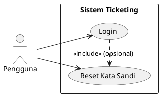
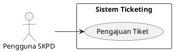
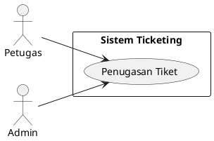
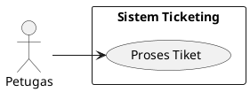
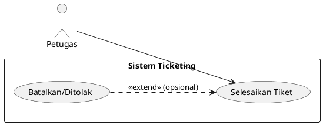
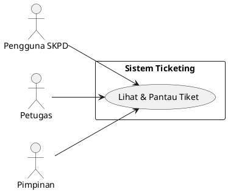
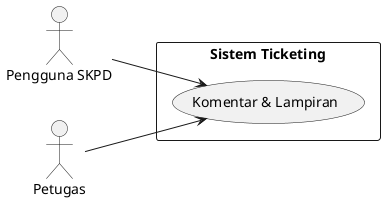
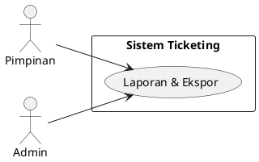
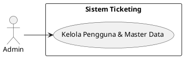
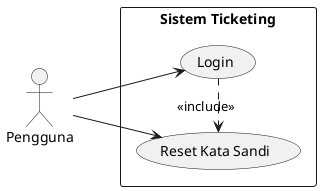

# BAB I

# PENDAHULUAN

## 1.1 Latar Belakang

Perkembangan teknologi informasi di lingkungan pemerintahan menuntut sistem kerja yang terstruktur, transparan, dan terdokumentasi. Dinas Komunikasi dan Informatika (Kominfo) Kota Bukittinggi kerap menerima permintaan bantuan dari berbagai Satuan Kerja Perangkat Daerah (SKPD) terkait infrastruktur TIK, aplikasi, jaringan, website, dan dukungan teknis.

Saat ini proses permintaan dan pelaporan masih bersifat konvensional (pesan singkat, komunikasi lisan, dokumen tidak terpusat), sehingga sulit melacak status pekerjaan, histori, dan beban kerja secara menyeluruh. Untuk mengatasi hal tersebut diperlukan Sistem Ticketing Pekerjaan sebagai media resmi pencatatan dan pelaporan, menampilkan status real-time, mendokumentasikan proses penanganan, dan menghasilkan laporan yang akurat.

Dengan sistem ini, koordinasi antar SKPD dan Kominfo menjadi lebih efektif, transparan, dan terukur, sekaligus mendukung peningkatan kualitas layanan pemerintahan berbasis digital.

## 1.2 Tujuan Proyek

- Membangun sistem terpusat untuk pengelolaan permintaan pekerjaan dari SKPD ke Kominfo.
- Memudahkan pemantauan status dan progres pekerjaan secara transparan dan real-time.
- Menyediakan laporan pekerjaan sebagai bahan evaluasi dan pengambilan keputusan.
- Meningkatkan akuntabilitas dan efisiensi proses layanan teknis Kominfo.

## 1.3 Ruang Lingkup

- Pengelolaan tiket: pembuatan, penugasan, prioritas, status (baru, diproses, selesai), dan penutupan.
- Manajemen pengguna: peran `Admin`, `Petugas Kominfo`, dan `SKPD` dengan hak akses terpisah.
- Notifikasi dan SLA sederhana: pengingat status, tenggat, dan eskalasi manual.
- Pelaporan: dashboard ringkas, rekap periodik, ekspor CSV/PDF.
- Integrasi dasar: email notifikasi; opsi integrasi WhatsApp/SMS pada fase lanjutan.

Di luar lingkup awal: otomasi penuh eskalasi lintas sistem, integrasi SSO pemda, dan mobile app native. Item-item ini dapat menjadi pengembangan berikutnya.

## 1.4 Target Pengguna

- SKPD pengusul tiket (pemohon layanan teknis).
- Petugas Kominfo (penangan tiket, teknisi, analis).
- Admin Kominfo (pengelola sistem, konfigurasi, pelaporan).
- Pimpinan Kominfo/Pemda (monitoring ringkas, laporan kinerja).

## 1.5 Sumber Daya yang Dibutuhkan

- Personel: 1 Project Manager, 1 System Analyst, 1 UI/UX Designer, 2 Backend Developer (Laravel), 1 Frontend Developer (Blade/Vite/Tailwind opsional), 1 QA/Tester, 1 DevOps (deployment & monitoring) paruh waktu, 1 Trainer.
- Infrastruktur: Server aplikasi (Linux/Windows), DB (MySQL/MariaDB), SMTP/email layanan, storage untuk lampiran tiket, domain/subdomain internal.
- Perangkat lunak: Laravel, PHP 8.x, Composer, Node.js + Vite, Git; alat QA (PHPUnit), monitoring (opsional), PDF generator.
- Dokumentasi & pelatihan: panduan pengguna, SOP tiket, modul pelatihan.

## 1.6 Estimasi Waktu Pengerjaan

Total durasi: 13–15 minggu.

Rincian:
- Analisis kebutuhan: 2 minggu
- Perancangan proses bisnis & alur: 2 minggu
- Desain aplikasi (UI/UX & arsitektur): 2 minggu
- Pengembangan & implementasi: 4–6 minggu
- Pengujian & penyempurnaan: 2 minggu
- Implementasi awal & pelatihan pengguna: 1 minggu

## 1.7 Timeline Pengerjaan

Minggu 1–2: Analisis kebutuhan (stakeholder interview, user stories, prioritas fitur)

Minggu 3–4: Perancangan proses bisnis & alur sistem (workflow tiket, peran & hak akses, SLA)

Minggu 5–6: Desain aplikasi (wireframe, prototipe, arsitektur, skema DB)

Minggu 7–10/12: Pengembangan & implementasi modul inti (tiket, pengguna, notifikasi, pelaporan dasar)

Minggu 11–12/14: Pengujian fungsional, UAT, perbaikan, hardening

Minggu 13–15: Implementasi awal, pelatihan, dokumentasi, go-live terbatas

## 1.8 Detail Phase per Timeline

1. Analisis kebutuhan
	- Aktivitas: wawancara, observasi proses, inventarisasi kebutuhan fungsional/non-fungsional.
	- Output: daftar kebutuhan, user stories, prioritas MVP.

2. Perancangan proses bisnis & alur
	- Aktivitas: pemetaan workflow tiket end-to-end, definisi peran & hak akses, aturan status & eskalasi.
	- Output: BPMN sederhana, SOP tiket, matriks RACI per aktivitas.

3. Desain aplikasi
	- Aktivitas: wireframe & prototipe tampilan, desain informasi, skema database, arsitektur modul.
	- Output: prototipe UI, ERD, diagram modul & integrasi.

4. Pengembangan & implementasi
	- Aktivitas: setup proyek, coding modul inti, integrasi email, pembuatan laporan dasar, keamanan dasar.
	- Output: aplikasi MVP siap uji, seed data, skrip deploy.

5. Pengujian & penyempurnaan
	- Aktivitas: test case, functional & regression test, UAT, perbaikan bug, optimasi kinerja.
	- Output: build stabil, laporan uji, daftar perbaikan.

6. Implementasi awal & pelatihan
	- Aktivitas: deployment terbatas, migrasi data awal (opsional), pelatihan pengguna, dokumentasi.
	- Output: sistem aktif untuk pilot, panduan pengguna & admin.

## 1.9 Milestone Timeline

- M1 (Akhir Minggu 2): Dokumen kebutuhan & prioritas MVP disetujui.
- M2 (Akhir Minggu 4): SOP & workflow tiket final.
- M3 (Akhir Minggu 6): Desain UI & arsitektur disetujui; ERD final.
- M4 (Minggu 10/12): Modul tiket, pengguna, notifikasi, pelaporan dasar selesai (MVP).
- M5 (Minggu 12/14): Laporan uji & perbaikan kritis ditutup.
- M6 (Minggu 13–15): Go-live terbatas & pelatihan selesai; rencana roll-out.

## 1.10 Resource Allocation Chart (Perkiraan)

- Project Manager: 30% sepanjang proyek.
- System Analyst: 100% Minggu 1–4, 50% Minggu 5–6, 25% Minggu 7–15.
- UI/UX Designer: 50% Minggu 3–6, 20% Minggu 7–10 (dukungan desain lanjutan).
- Backend Developer (2 orang): 80–100% Minggu 7–12, 50% Minggu 13–15.
- Frontend Developer: 70–90% Minggu 7–12, 40% Minggu 13–15.
- QA/Tester: 20% Minggu 7–10, 80–100% Minggu 11–14, 30% Minggu 15.
- DevOps (paruh waktu): 20% Minggu 5–6, 30% Minggu 11–15.
- Trainer: 50–70% Minggu 13–15.

## 1.11 Dependency Risk

- Ketergantungan pada ketersediaan data & proses existing SKPD untuk validasi alur.
- Ketergantungan pada infrastruktur email/SMTP untuk notifikasi.
- Ketergantungan persetujuan desain & SOP dari pimpinan untuk memulai pengembangan.
- Risiko perubahan kebijakan internal yang mempengaruhi workflow.

Mitigasi:
- Sediakan mock data & simulasi proses bila data belum siap.
- Siapkan fallback notifikasi (log aktivitas dalam aplikasi, dashboard pengingat) jika email terganggu.
- Tetapkan komite kecil untuk persetujuan cepat; gunakan timebox.
- Dokumentasikan perubahan kebijakan dan lakukan penyesuaian terkontrol (change management).

## 1.12 Budget Allocation Timeline (Persentase Per Fase)

- Analisis kebutuhan: 10%
- Perancangan proses & alur: 10%
- Desain aplikasi: 15%
- Pengembangan & implementasi: 40%
- Pengujian & penyempurnaan: 15%
- Implementasi awal & pelatihan: 10%

Catatan: Persentase dapat disesuaikan mengikuti kebijakan penganggaran dan kondisi riil.

## 1.13 Risiko & Mitigasi

- Keterlambatan persetujuan stakeholder: lakukan review berkala mingguan, gunakan notulen & keputusan tertulis.
- Ketidaksesuaian kebutuhan saat UAT: awali dengan MVP jelas, backlog perbaikan terprioritas, lakukan sprint pendek.
- Keterbatasan infrastruktur server: mulai dengan spesifikasi minimum, lakukan load test sederhana, rencana scaling bertahap.
- Keamanan data & akses: terapkan role-based access, audit log, enkripsi transport (HTTPS), backup berkala.
- Ketergantungan personel kunci: dokumentasi menyeluruh, pair programming, knowledge transfer.

## 1.14 Sistematika Penulisan

- Bab I Pendahuluan: latar belakang, tujuan, ruang lingkup, target pengguna, sumber daya, estimasi waktu, timeline, phase detail, milestone, resource allocation, dependency risk, budget, risiko & mitigasi.
- Bab II Analisis Kebutuhan Sistem: kebutuhan fungsional & non-fungsional.
- Bab III Proses Bisnis Sistem: alur kerja & interaksi antar pihak.
- Bab IV Desain Aplikasi: tampilan & struktur sistem.

---

# BAB II

# ANALISIS KEBUTUHAN SISTEM

## 2.1 Pendahuluan

Sistem Ticketing Layanan Kominfo Kota Bukittinggi adalah aplikasi web internal untuk mencatat, mengelola, dan melaporkan permintaan bantuan teknis dari SKPD. Tujuannya adalah menyediakan proses yang terstandar, transparan, dan terukur dari pengajuan hingga penyelesaian pekerjaan, sekaligus menyajikan data beban kerja bagi pimpinan.

Ruang lingkup pada tahap awal (MVP) mencakup pengelolaan tiket end-to-end, peran pengguna (`SKPD`, `Petugas Kominfo`, `Admin`, `Pimpinan`), notifikasi email dasar, serta pelaporan ringkas. Integrasi lanjutan (SSO, WA/SMS, otomasi eskalasi penuh) direncanakan di fase berikutnya.

<!-- Catatan Duplikasi: Ruang lingkup & peran pengguna telah dibahas pada Bab I 1.3 dan 1.4; notifikasi email & pelaporan ringkas juga disebut di Bab I 1.3. -->

## 2.2 Kebutuhan Fungsional (Detail)

- Autentikasi & Otorisasi
	- Login berbasis akun internal; reset kata sandi via email.
	- Role-based access control: `SKPD`, `Petugas`, `Admin`, `Pimpinan`.
	- Manajemen sesi dan logout aman.

- Manajemen Pengguna & SKPD (Admin)
	- CRUD pengguna: buat, ubah, nonaktifkan, reset kata sandi.
	- Penetapan peran dan asosiasi ke SKPD (untuk pengguna SKPD).
	- CRUD data master SKPD dan struktur unit kerja.

- Manajemen Data Master (Admin)
	- CRUD jenis pekerjaan/kategori, prioritas, dan label/tag.
	- Pengaturan status tiket yang diizinkan dan transisinya (workflow sederhana).
	- Pengaturan SLA dasar per kategori/prioritas (opsional di MVP).

- Tiket Pekerjaan (SKPD, Petugas)
	- Pembuatan tiket oleh SKPD dengan field minimal:
		- Judul, deskripsi rinci, kategori/jenis pekerjaan, prioritas, SKPD pemohon (auto), lampiran (opsional), kontak/pic.
	- Penomoran tiket otomatis dan unik (format: tahun-bulan-sekuens).
	- Validasi isian wajib dan ukuran/jenis berkas lampiran.
	- Penugasan tiket ke petugas/tipe tim oleh Petugas/Admin.
	- Perubahan status: `Baru` → `Diproses` → `Selesai` (dengan opsi `Ditolak/Dibatalkan`).
	- Pencatatan progres: komentar, catatan teknis, dan riwayat aktivitas.
	- Penutupan tiket dengan ringkasan hasil/solusi dan waktu selesai.

- Notifikasi
	- Email notifikasi saat: tiket dibuat, diassign, status berubah, dan ditutup.
	- Preferensi notifikasi per pengguna (opsional di MVP).

- Pencarian, Filter, dan Sortir
	- Pencarian teks pada judul/nomor tiket.
	- Filter berdasarkan status, kategori, prioritas, tanggal, SKPD, petugas.
	- Sortir berdasarkan tanggal dibuat, prioritas, tenggat, status.

- Dashboard & Pelaporan
	- Dashboard ringkas per peran: total tiket, status, tren periode.
	- Laporan berdasarkan periode, SKPD, kategori, status.
	- Ekspor laporan ke CSV/PDF.

- Audit & Keamanan Data
	- Audit log: siapa melakukan apa dan kapan pada tiket dan master data.
	- Pembatasan akses data sesuai peran (SKPD hanya melihat tiketnya, Petugas/Admin melihat semua).

- Admin Sistem
	- Pengaturan umum: email/SMTP, logo/nama instansi, preferensi tampilan.
	- Backup/restore basis data (prosedural, dapat berupa SOP di luar aplikasi).

Catatan workflow tiket (state & aturan transisi):
- State utama: `Baru`, `Diproses`, `Selesai`; state sampingan: `Ditolak`, `Dibatalkan`.
- Aturan contoh: hanya Petugas/Admin yang dapat mengubah `Baru` → `Diproses`; tiket `Selesai` hanya dapat dibuka ulang oleh Admin (opsional) dengan alasan.

<!-- Catatan Duplikasi: Alur status & pelaporan CSV/PDF konsisten dengan Bab I 1.3 dan diulang pada Bab III 3.3 serta Bab IV 4.9. -->

## 2.3 Kebutuhan Non-Fungsional (Detail)

- Keamanan
	- HTTPS wajib; penyimpanan kata sandi dengan hashing yang kuat (bcrypt/argon2).
	- Validasi input dan proteksi CSRF/XSS/SQL Injection.
	- Kontrol akses berbasis peran pada backend dan UI.

- Kinerja
	- Waktu muat halaman daftar tiket ≤ 3 detik pada 2000 tiket terindeks.
	- Pencarian/filter merespon ≤ 2 detik untuk 10.000 entri dengan indeks yang tepat.

- Ketersediaan & Reliabilitas
	- Target ketersediaan jam kerja; pemulihan insiden ≤ 4 jam kerja.
	- Backup harian dan retensi minimal 30 hari.

- Skalabilitas
	- Mampu menampung pertumbuhan tiket dan pengguna 3–5× tanpa perubahan arsitektur mayor.

- Kemudahan Penggunaan & Aksesibilitas
	- Navigasi konsisten, form dengan validasi jelas, pesan error informatif.
	- Kontras warna dan ukuran font mengikuti pedoman aksesibilitas dasar.

- Maintainability & Observability
	- Struktur kode modular (Laravel), logging terstandar, konfigurasi via env.
	- Dokumentasi admin & SOP operasional tersedia.

- Kompatibilitas
	- Browser modern (Chrome, Edge, Firefox) versi 2 tahun terakhir.
	- Integrasi SMTP standar; DB MySQL/MariaDB.

## 2.4 Use Case Umum Sistem (Detail)

UC-01 Login
- Aktor: Semua pengguna
- Tujuan: Mengakses sistem sesuai peran
- Prasyarat: Akun aktif
- Alur Utama: Buka halaman login → masukkan kredensial → autentikasi → masuk dashboard peran
- Alternatif: Lupa kata sandi → permintaan reset via email
- Pascakondisi: Sesi aktif tercipta

UC-02 Pengajuan Tiket (SKPD)
- Aktor: Pengguna SKPD
- Tujuan: Membuat tiket baru
- Prasyarat: Login, SKPD terasosiasi
- Alur Utama: Buka formulir → isi judul, deskripsi, kategori, prioritas, lampiran → kirim → tiket tercatat (status Baru) → notifikasi terkirim
- Alternatif: Validasi gagal → tampilkan pesan; unggahan melampaui batas → tolak unggahan
- Pascakondisi: Tiket baru dengan nomor unik

UC-03 Penugasan Tiket
- Aktor: Petugas/Admin
- Tujuan: Menetapkan penanggung jawab
- Prasyarat: Tiket status Baru
- Alur Utama: Buka detail tiket → pilih petugas → simpan → notifikasi ke petugas
- Pascakondisi: Field penanggung jawab terisi

UC-04 Proses Tiket
- Aktor: Petugas
- Tujuan: Memulai/menandai pengerjaan
- Prasyarat: Tiket ter-assign
- Alur Utama: Ubah status ke Diproses → tambahkan catatan/progres → unggah bukti jika perlu
- Pascakondisi: Riwayat progres tercatat

UC-05 Selesaikan Tiket
- Aktor: Petugas
- Tujuan: Menutup tiket
- Prasyarat: Pekerjaan selesai
- Alur Utama: Isi ringkasan hasil → ubah status ke Selesai → notifikasi ke pemohon
- Alternatif: Batalkan/ Tolak dengan alasan → status Dibatalkan/Ditolak
- Pascakondisi: Tiket tertutup, waktu selesai tercatat

UC-06 Lihat & Pantau Tiket
- Aktor: SKPD, Petugas, Pimpinan
- Tujuan: Melihat daftar dan detail tiket
- Prasyarat: Login
- Alur Utama: Buka daftar → gunakan filter/sortir → buka detail → lihat riwayat
- Pascakondisi: Tidak ada perubahan data

UC-07 Komentar & Lampiran
- Aktor: SKPD, Petugas
- Tujuan: Komunikasi dan bukti kerja
- Prasyarat: Akses ke tiket
- Alur Utama: Tambah komentar/unggah lampiran → tersimpan di timeline
- Pascakondisi: Aktivitas tercatat di audit log

UC-08 Laporan & Ekspor
- Aktor: Pimpinan/Admin
- Tujuan: Mendapatkan rekap beban kerja
- Prasyarat: Data tersedia
- Alur Utama: Pilih periode/SKPD/kategori → lihat ringkasan → ekspor CSV/PDF
- Pascakondisi: Berkas laporan tersedia untuk unduh

UC-09 Kelola Pengguna & Master Data
- Aktor: Admin
- Tujuan: Menjaga data dan konfigurasi
- Alur Utama: CRUD pengguna, SKPD, kategori, prioritas; atur SMTP dan preferensi
- Pascakondisi: Konfigurasi tersimpan, berpengaruh ke sistem

UC-10 Reset Kata Sandi
- Aktor: Semua pengguna
- Tujuan: Memulihkan akses
- Alur Utama: Minta reset → email tautan reset → set kata sandi baru
- Pascakondisi: Kredensial baru aktif

### 2.4.1 Deskripsi Gambar Use Case per UC

UC-01 Login — Deskripsi Diagram
- Aktor: `Pengguna` (mewakili semua peran)
- Boundary: Sistem Ticketing
- Use case: Login; relasi asosiasi dari aktor ke use case
- Relasi tambahan: include opsional ke `Reset Kata Sandi`



UC-02 Pengajuan Tiket — Deskripsi Diagram
- Aktor: `Pengguna SKPD`
- Boundary: Sistem Ticketing
- Use case: Pengajuan Tiket (membuat tiket baru)
- Relasi: asosiasi aktor SKPD ke use case



UC-03 Penugasan Tiket — Deskripsi Diagram
- Aktor: `Petugas`, `Admin`
- Boundary: Sistem Ticketing
- Use case: Penugasan Tiket (menetapkan penanggung jawab)
- Relasi: asosiasi Petugas/Admin ke use case



UC-04 Proses Tiket — Deskripsi Diagram
- Aktor: `Petugas`
- Boundary: Sistem Ticketing
- Use case: Proses Tiket (ubah status ke Diproses, tambah progres)
- Relasi: asosiasi Petugas ke use case



UC-05 Selesaikan Tiket — Deskripsi Diagram
- Aktor: `Petugas`
- Boundary: Sistem Ticketing
- Use case: Selesaikan Tiket (tutup tiket, ringkas hasil)
- Relasi: asosiasi Petugas ke use case
- Catatan: extend ke `Batalkan/Ditolak` bila diperlukan



UC-06 Lihat & Pantau Tiket — Deskripsi Diagram
- Aktor: `SKPD`, `Petugas`, `Pimpinan`
- Boundary: Sistem Ticketing
- Use case: Lihat & Pantau Tiket (daftar/detail, filter/sortir)
- Relasi: asosiasi masing-masing aktor ke use case



UC-07 Komentar & Lampiran — Deskripsi Diagram
- Aktor: `SKPD`, `Petugas`
- Boundary: Sistem Ticketing
- Use case: Komentar & Lampiran (komunikasi pada tiket)
- Relasi: asosiasi aktor ke use case



UC-08 Laporan & Ekspor — Deskripsi Diagram
- Aktor: `Pimpinan`, `Admin`
- Boundary: Sistem Ticketing
- Use case: Laporan & Ekspor (lihat rekap, ekspor CSV/PDF)
- Relasi: asosiasi aktor ke use case



UC-09 Kelola Pengguna & Master Data — Deskripsi Diagram
- Aktor: `Admin`
- Boundary: Sistem Ticketing
- Use case: Kelola Pengguna & Master Data
- Relasi: asosiasi Admin ke use case



UC-10 Reset Kata Sandi — Deskripsi Diagram
- Aktor: `Pengguna`
- Boundary: Sistem Ticketing
- Use case: Reset Kata Sandi
- Relasi: asosiasi Pengguna ke use case
- Catatan: dapat di-include oleh use case Login



## 2.5 Spesifikasi UI (Detail)

- Prinsip Umum
	- Desain sederhana, konsisten, dan mobile-friendly (responsive dasar).
	- Navigasi utama: menu sisi/kepala dengan item: Dashboard, Tiket, Pengajuan, Laporan, Manajemen (khusus Admin).

- Halaman Login
	- Field: Email/Username, Kata Sandi; tombol Masuk; tautan Lupa Kata Sandi.
	- Validasi: wajib isi, format email benar, pesan kesalahan jelas.

- Dashboard
	- Komponen: ringkasan angka (tiket baru/diproses/selesai), grafik tren bulanan, daftar tugas saya (untuk Petugas), notifikasi terbaru.
	- Filter cepat: periode (minggu/bulan), SKPD (untuk Admin/Pimpinan).

- Pengajuan Tiket (Form)
	- Field wajib: Judul, Deskripsi, Kategori/Jenis, Prioritas, Kontak/PIC.
	- Field opsional: Lampiran (pdf, jpg, png; ≤ 5–10 MB per berkas), Tanggal target (opsional).
	- Kontrol: tombol Simpan/Kirim, Batalkan, indikator progres unggah.
	- Validasi: batas panjang judul (≤ 150), deskripsi minimum (≥ 20 karakter).

- Daftar Tiket
	- Kolom: Nomor, Judul, SKPD, Kategori, Prioritas (warna label), Status (badge warna), Petugas, Tgl Dibuat, Tgl Update.
	- Fitur: pencarian, filter (status/kategori/prioritas/SKPD/petugas/periode), sortir, pagination, aksi baris (lihat, ubah status), aksi massal (opsional).
	- Empty state: pesan informatif dan ajakan membuat tiket.

- Detail Tiket
	- Header: nomor tiket, status (badge), prioritas, petugas penanggung jawab, tombol aksi (Ubah Status, Assign, Selesai/Batalkan).
	- Tab/Bagian: Informasi Utama (judul, deskripsi, kategori, SKPD), Timeline Aktivitas (komentar, perubahan status), Lampiran, Riwayat.
	- Komentar: editor teks sederhana, unggah lampiran; tampil secara kronologis.

- Manajemen Data (Admin)
	- Pengguna: tabel (Nama, Email, Peran, SKPD, Status), form tambah/ubah, reset kata sandi.
	- SKPD: tabel dan form CRUD.
	- Jenis Pekerjaan/Prioritas: tabel dan form CRUD; warna label prioritas.
	- Pengaturan: SMTP, identitas instansi, logo, batas unggahan.

- Laporan
	- Filter: periode tanggal, SKPD, kategori, status.
	- Tampilan: ringkasan angka, diagram batang/garis sederhana, tabel rekap.
	- Aksi: ekspor CSV/PDF, cetak.

- Notifikasi
	- Email template dasar untuk: tiket dibuat, diassign, status berubah, tiket selesai.
	- Placeholder dinamis: nomor tiket, judul, status, nama petugas, tautan detail.

- Pola UI & Aksesibilitas
	- Warna status: Baru (abu/baru), Diproses (biru), Selesai (hijau), Ditolak/Dibatalkan (merah/kuning).
	- Focus state jelas, ukuran target klik memadai, teks alternatif untuk ikon.
	- Pesan sukses/gagal konsisten, loading spinner pada aksi berat, konfirmasi untuk tindakan destruktif.

Catatan: Desain visual detail (komponen, spacing, warna) akan diturunkan dalam panduan desain/Style Guide dan prototipe UI (wireframe → high-fidelity) pada fase desain.

<!-- Catatan Duplikasi: Spesifikasi UI/antarmuka selaras dengan Bab IV 4.4; detail komponen dan layar di Bab IV mengulang konsep yang sama. -->

---

# BAB III

# PROSES BISNIS SISTEM

## 3.1 Gambaran Umum Proses Bisnis

Proses bisnis dalam Sistem Ticketing Layanan Kominfo Kota Bukittinggi dirancang untuk menggambarkan alur kerja permintaan bantuan pekerjaan dari SKPD hingga menjadi laporan yang dapat dipantau oleh pimpinan. Sistem ini menempatkan Kominfo sebagai pelaksana utama layanan TIK, sementara SKPD berperan sebagai pemohon layanan.

Fokus utama proses bisnis ini adalah memastikan setiap permintaan pekerjaan tercatat secara resmi, dapat dipantau progresnya, serta menghasilkan data jumlah dan beban kerja yang terukur.

## 3.2 Aktor yang Terlibat dalam Proses Bisnis

Aktor yang terlibat dalam proses bisnis sistem ini terdiri dari:

1. **SKPD**: Mengajukan permintaan pekerjaan melalui sistem ticketing.
2. **Petugas Kominfo**: Menerima, memproses, dan menyelesaikan tiket pekerjaan.
3. **Administrator**: Mengelola data master dan pengguna sistem.
4. **Pimpinan**: Memantau laporan dan rekap beban kerja.

<!-- Catatan Duplikasi: Aktor/peran pengguna telah disebut di Bab I 1.4 dan dirinci lagi di Bab IV 4.2. -->

## 3.3 Alur Proses Bisnis Pengajuan dan Penanganan Tiket

Alur proses bisnis sistem ticketing secara umum adalah sebagai berikut:

1. SKPD melakukan pengajuan permintaan pekerjaan melalui sistem dengan mengisi informasi yang dibutuhkan.
2. Sistem mencatat tiket dengan status **Baru**.
3. Petugas Kominfo menerima tiket dan melakukan verifikasi awal.
4. Tiket yang valid diproses dan status berubah menjadi **Diproses**.
5. Petugas Kominfo melakukan pekerjaan sesuai permintaan.
6. Setelah pekerjaan selesai, petugas memperbarui status tiket menjadi **Selesai** dan mengisi keterangan hasil pekerjaan.
7. Data tiket yang telah selesai akan masuk ke dalam rekap laporan.
8. Pimpinan dapat melihat laporan jumlah pekerjaan dan beban kerja Kominfo.

<!-- Catatan Duplikasi: Alur status Baru→Diproses→Selesai telah dijelaskan di Bab I 1.3 dan Bab II 2.2/2.4. -->

## 3.4 Diagram Alur Proses Bisnis

Berikut adalah diagram alur proses bisnis Sistem Ticketing Layanan Kominfo Kota Bukittinggi secara naratif:

```
[SKPD]
   |
   | 1. Mengajukan Permintaan Pekerjaan
   v
[Sistem Ticketing]
   |
   | 2. Mencatat Tiket (Status: Baru)
   v
[Petugas Kominfo]
   |
   | 3. Verifikasi & Penanganan
   v
[Sistem Ticketing]
   |
   | 4. Update Status (Diproses)
   v
[Petugas Kominfo]
   |
   | 5. Menyelesaikan Pekerjaan
   v
[Sistem Ticketing]
   |
   | 6. Update Status (Selesai)
   v
[Laporan & Rekapitulasi]
   |
   | 7. Monitoring
   v
[Pimpinan]
```

Diagram tersebut menunjukkan bahwa sistem berperan sebagai pusat pencatatan dan pengendalian proses kerja, sehingga seluruh aktivitas dapat dimonitor secara terpusat.

## 3.5 Proses Monitoring dan Pelaporan

Proses monitoring dan pelaporan dilakukan berdasarkan data tiket yang tercatat di dalam sistem. Informasi yang disajikan meliputi:

1. Jumlah tiket berdasarkan SKPD.
2. Jumlah tiket berdasarkan status pekerjaan.
3. Rekap pekerjaan yang telah diselesaikan.
4. Gambaran beban kerja Kominfo dalam periode tertentu.

Laporan ini digunakan oleh pimpinan sebagai bahan evaluasi kinerja dan dasar pengambilan keputusan terkait peningkatan layanan.

<!-- Catatan Duplikasi: Pelaporan & monitoring telah dibahas di Bab I 1.3 dan Bab II 2.2/UC-08; Bab IV 4.9 juga menguraikan laporan. -->

## 3.6 Spesifikasi Aktor Sistem

Aktor-aktor berikut berinteraksi dalam proses bisnis beserta tanggung jawab, hak akses, dan aksi utamanya:

1. SKPD (Pemohon)
    - Deskripsi: Unit kerja pemda yang mengajukan permintaan bantuan pekerjaan TIK.
    - Tanggung jawab utama:
       - Mengisi dan mengirim tiket dengan informasi yang lengkap dan akurat.
       - Menyediakan lampiran pendukung bila diperlukan.
       - Merespons pertanyaan/progres dari petugas.
    - Hak akses data:
       - Melihat seluruh tiket yang diajukan oleh SKPD-nya.
       - Melihat status, riwayat aktivitas, dan hasil pekerjaan tiket miliknya.
    - Aksi utama di sistem:
       - Buat tiket, lihat/ikuti tiket, beri komentar, unggah lampiran, unduh laporan terkait tiket sendiri.
    - Indikator kinerja (informal): kelengkapan pengajuan, kecepatan respons saat klarifikasi.

2. Petugas Kominfo (Pelaksana)
    - Deskripsi: Personel Kominfo yang menangani dan menyelesaikan tiket.
    - Tanggung jawab utama:
       - Verifikasi awal, mengubah status, mengerjakan tugas, dan mencatat progres.
       - Berkomunikasi dengan pemohon untuk klarifikasi.
       - Menutup tiket dengan ringkasan hasil yang jelas.
    - Hak akses data:
       - Melihat semua tiket; mengubah tiket yang ditugaskan atau sesuai kewenangan.
       - Akses ke seluruh riwayat aktivitas dan lampiran tiket.
    - Aksi utama di sistem:
       - Tinjau/ambil tiket, assign (jika diberi kewenangan), ubah status, tambah progres/komentar, unggah bukti, tutup tiket.
    - Indikator kinerja: waktu tanggap awal, waktu penyelesaian, jumlah tiket selesai.

3. Administrator (Admin Sistem)
    - Deskripsi: Pengelola konfigurasi, data master, dan akun pengguna.
    - Tanggung jawab utama:
       - Mengelola pengguna, peran, SKPD, jenis pekerjaan, prioritas, dan pengaturan sistem (SMTP, identitas).
       - Menjaga integritas data dan membatasi akses sesuai kebijakan.
    - Hak akses data:
       - Akses penuh ke semua data master dan konfigurasi; akses baca ke seluruh tiket.
    - Aksi utama di sistem:
       - CRUD master data, kelola akun/peran, pengaturan sistem, bantuan operasional.
    - Indikator kinerja: konsistensi data master, ketersediaan sistem, kepatuhan konfigurasi.

4. Pimpinan (Pengambil Keputusan)
    - Deskripsi: Pejabat yang memonitor beban kerja dan kinerja layanan.
    - Tanggung jawab utama:
       - Meninjau rekapitulasi pekerjaan dan tren kinerja.
       - Memberi arahan untuk prioritas atau kebijakan layanan.
    - Hak akses data:
       - Akses baca ke laporan agregat, dashboard ringkasan, dan detail tiket bila diperlukan (read-only).
    - Aksi utama di sistem:
       - Melihat dashboard, menjalankan laporan, mengunduh rekap.
    - Indikator kinerja: pemanfaatan laporan untuk evaluasi, ketepatan arahan prioritas.

Catatan: Rincian kewenangan granular (mis. siapa yang boleh re-assign, reopen, delete lampiran) ditetapkan di kebijakan peran dan SOP operasional.

<!-- Catatan Duplikasi: Spesifikasi peran & akses juga dijabarkan di Bab IV 4.2. -->

## 3.7 Berkas/Dokumen yang Terlibat

Dokumen/berkas yang terbentuk atau digunakan sepanjang siklus tiket:

- Formulir Pengajuan Tiket
   - Isi minimum: Judul, Deskripsi, Kategori/Jenis, Prioritas, SKPD, Kontak/PIC, Tanggal pengajuan, Lampiran (opsional).
   - Format: entri pada sistem (database); dapat dicetak sebagai PDF ringkas.

- Lampiran Pendukung
   - Jenis: gambar (jpg/png), dokumen (pdf/docx), arsip (zip) sesuai kebijakan.
   - Batas ukuran: 5–10 MB per berkas (dapat dikonfigurasi).
   - Penyimpanan: direktori storage dengan referensi di database; penamaan aman dan unik.

- Catatan Progres/Timeline Aktivitas
   - Isi: komentar, perubahan status, penugasan, waktu stempel, pelaku.
   - Fungsi: audit trail dan komunikasi sepanjang penanganan tiket.

- Ringkasan Hasil Pekerjaan (Berita Acara Sederhana)
   - Isi: ringkasan tindakan, hasil, tanggal selesai, penanggung jawab.
   - Bentuk: field pada tiket + opsi unduh PDF sebagai berita acara ringkas.

- Surat Tugas/Disposisi (opsional, sesuai SOP internal)
   - Isi: perintah kerja/penugasan formal.
   - Sumber: diunggah oleh admin/petugas bila diperlukan.

- Notifikasi Email
   - Template: tiket dibuat, diassign, status berubah, tiket selesai.
   - Variabel: nomor tiket, judul, status, petugas, tautan detail.

- Laporan Periodik
   - Jenis: rekap per periode, per SKPD, per kategori, per status.
   - Format: tampilan layar, ekspor CSV/PDF; dapat dicetak.

- Ekspor Data
   - Tujuan: analisis lanjutan (mis. spreadsheet) atau arsip.
   - Konten: subset kolom tiket, progres terpilih; terikat kebijakan privasi internal.

- SOP & Panduan Pengguna
   - Isi: langkah penggunaan sistem, peran & tanggung jawab, kebijakan status.
   - Bentuk: dokumen PDF/Markdown di repository dokumentasi internal.

Aspek tata kelola berkas/dokumen:
- Retensi: backup harian, retensi minimal 30 hari (dapat disesuaikan kebijakan pemda).
- Klasifikasi: informasi internal; lindungi data sensitif (kontak pribadi, lampiran tertentu).
- Penamaan & Versi: penamaan unik otomatis untuk lampiran; perubahan metadata tercatat di audit log.
- Akses: sesuai peran; SKPD hanya mengakses lampiran pada tiketnya; Petugas/Admin mengakses lampiran sesuai tugas.
- Kepatuhan: patuhi kebijakan keamanan informasi pemda (encrypt in-transit/HTTPS; kontrol akses).

---

# BAB IV

# DESAIN APLIKASI

## 4.1 Gambaran Umum Desain Aplikasi

Desain Sistem Ticketing Layanan Kominfo Kota Bukittinggi dirancang dengan pendekatan sederhana, fungsional, dan mudah digunakan oleh seluruh pengguna internal Pemerintah Kota Bukittinggi. Aplikasi ini berfokus pada kejelasan informasi, kemudahan input data, serta kemudahan monitoring beban kerja.

Aplikasi bersifat berbasis web dan dapat diakses sesuai dengan hak akses masing-masing pengguna.

## 4.2 Desain Peran dan Hak Akses Pengguna

Sistem ini memiliki beberapa peran pengguna dengan hak akses yang berbeda, yaitu:

1. **Pengguna SKPD**

   * Mengajukan tiket permintaan pekerjaan.
   * Melihat status dan riwayat tiket yang diajukan.

2. **Petugas Kominfo**

   * Melihat seluruh tiket yang masuk.
   * Memproses dan memperbarui status tiket.
   * Mengisi keterangan progres dan hasil pekerjaan.

3. **Administrator Sistem**

   * Mengelola data pengguna dan SKPD.
   * Mengelola data master (jenis pekerjaan, status, dan lainnya).

4. **Pimpinan**

   * Melihat dashboard ringkasan pekerjaan.
   * Mengakses laporan jumlah dan beban kerja.

### 4.2.1 Spesifikasi Detail Peran & Akses

- Admin Sistem
  - Akses: penuh ke konfigurasi, data master (SKPD, jenis pekerjaan, prioritas), manajemen pengguna/peran, audit log, laporan, seluruh tiket (read/write), pengaturan SMTP/identitas.
  - Aksi kunci: CRUD master data; tambah/nonaktifkan pengguna; reset kata sandi; re-assign tiket; re-open tiket (opsional); set batas unggahan; kelola template email.
  - Batasan: tindakan destruktif (hapus permanen) membutuhkan konfirmasi dua langkah.

- Petugas Kominfo
  - Akses: lihat semua tiket; ubah tiket yang ditugaskan; tambah progres, komentar, lampiran; ubah status (Baru→Diproses→Selesai); generate ringkasan hasil; lihat laporan ringkas.
  - Aksi kunci: ambil tiket (self-assign) jika diperbolehkan; serahkan ke petugas lain (opsional kebijakan); tandai butuh klarifikasi; unggah bukti.
  - Batasan: tidak dapat mengubah data master/kebijakan; tidak dapat menghapus lampiran pengguna tanpa alasan & log.

- Pengguna SKPD
  - Akses: buat tiket; lihat tiket milik SKPD-nya; komentar; tambah lampiran; lihat ringkasan hasil.
  - Batasan: tidak dapat mengubah atribut inti tiket setelah dibuat (judul/kategori/prioritas) selain menambah komentar/lampiran; tidak dapat melihat tiket SKPD lain.

- Pimpinan
  - Akses: dashboard dan laporan agregat; drill-down baca ke detail tiket (tanpa ubah); ekspor laporan.
  - Batasan: tidak dapat menambah/mengubah tiket atau master data.

Kontrol akses data dan transisi status dirangkum dalam kebijakan: hanya Petugas/Admin yang dapat memindahkan `Baru`→`Diproses`; penutupan tiket membutuhkan ringkasan hasil; pembukaan ulang tiket memerlukan alasan (role Admin).

<!-- Catatan Duplikasi: Peran & hak akses tumpang tindih dengan Bab III 3.6 dan Bab II 2.1/2.2. -->

## 4.3 Struktur Menu Aplikasi

Struktur menu aplikasi dirancang agar mudah dipahami dan disesuaikan dengan peran pengguna, antara lain:

* **Dashboard**
  Menampilkan ringkasan jumlah tiket, status pekerjaan, dan beban kerja.

* **Tiket Pekerjaan**
  Berisi daftar tiket masuk, tiket diproses, dan tiket selesai.

* **Pengajuan Tiket**
  Digunakan oleh SKPD untuk membuat permintaan pekerjaan baru.

* **Laporan**
  Menampilkan rekap pekerjaan berdasarkan periode, SKPD, dan status.

* **Manajemen Data**
  Digunakan administrator untuk mengelola data pendukung sistem.

### 4.3.1 Spesifikasi Navigasi & Rute

- Konvensi penamaan rute (Laravel):
  - `dashboard.index`, `tickets.index`, `tickets.create`, `tickets.show`, `tickets.updateStatus`,
    `reports.index`, `admin.users.index`, `admin.users.create`, `admin.departments.index`,
    `admin.categories.index`, `admin.settings.index`.
- Visibilitas menu per peran:
  - SKPD: Dashboard, Tiket (daftar & detail), Pengajuan, Laporan (terbatas untuk tiket sendiri).
  - Petugas: Dashboard, Tiket (semua), Laporan ringkas; Pengajuan opsional; tidak ada menu Admin.
  - Pimpinan: Dashboard, Laporan penuh; akses baca ke Tiket.
  - Admin: seluruh menu termasuk Manajemen Data & Pengaturan.
- Indikator UI:
  - Badge jumlah tiket baru pada menu Tiket (role Petugas/Admin).
  - Highlight menu aktif; breadcrumbs pada halaman detail.
- Kebijakan akses pada rute dilindungi middleware: `auth`, `role:admin|petugas|skpd|pimpinan`.

## 4.4 Gambaran Antarmuka Aplikasi

Antarmuka aplikasi dirancang dengan prinsip sederhana dan informatif, dengan menggunakan Bootstrap 5.3.2 sebagai framework UI, Bootstrap Icons 1.11.1 untuk ikon, dan Blade templating untuk rendering dinamis. Desain responsif diterapkan pada semua halaman untuk mendukung akses dari berbagai perangkat.

Antarmuka terdiri dari beberapa bagian utama:

1. **Layout Utama**: Navigasi atas (navbar) dengan logo instansi dan menu pengguna; sidebar navigasi di kiri dengan menu sesuai peran pengguna; area konten utama; footer.
2. **Halaman Dashboard**: Menampilkan ringkasan statistik dengan kartu KPI, grafik tren, dan daftar aktivitas terbaru.
3. **Halaman Pengajuan Tiket**: Formulir terstruktur dengan field wajib/opsional, validasi inline, dan preview.
4. **Halaman Daftar Tiket**: Tabel dengan pencarian, filter, dan sortir; status ditampilkan dengan badge warna; aksi per baris.
5. **Halaman Detail Tiket**: Informasi utama dalam panel, timeline aktivitas kronologis, lampiran, dan riwayat status.
6. **Halaman Manajemen Tiket (Admin)**: Antarmuka tab untuk penugasan otomatis, penugasan manual, simulasi konfigurasi, dan history perubahan.
7. **Halaman Laporan**: Filter dan widget untuk tampilan ringkas; ekspor CSV/PDF tersedia.

### 4.4.1 Spesifikasi Layar & Komponen

**A. Halaman Login**
- Komponen: Logo/brand, form login (email/username, password), tombol "Masuk", link "Lupa Kata Sandi".
- Validasi sisi-klien: field wajib, format email; sisi-server: kredensial & aktifasi akun.
- Pesan: sukses (redirect dashboard), gagal (credential invalid / akun tidak aktif), warning (rate limit).
- Styling: Warna brand Kominfo (biru), form responsif, centered layout.

**B. Halaman Dashboard**
- Widget KPI (4 kartu):
  - Total Tiket (periode berjalan)
  - Tiket Baru (badge warning)
  - Tiket Diproses (badge info)
  - Tiket Selesai (badge success)
- Grafik tren: Bar/line chart bulanan menampilkan trend per status (library Chart.js).
- Daftar aktivitas terbaru: Tabel mini 5–10 baris terakhir dengan kolom nomor tiket, judul, status, waktu.
- Filter cepat: Dropdown periode (minggu/bulan), SKPD (untuk Admin/Pimpinan).
- Akses berdasarkan peran:
  - SKPD: melihat hanya tiket miliknya; KPI sesuai data pribadi.
  - Petugas: melihat semua tiket + tugas saya (assigned to me).
  - Pimpinan: melihat ringkasan agregat; filter SKPD.
  - Admin: akses penuh; informasi sistem (user aktif, log aktivitas terbaru).

**C. Halaman Pengajuan Tiket**
- Judul halaman: "Ajukan Tiket Pekerjaan Baru" / "Formulir Pengajuan Tiket".
- Form struktur:
  - **Field Wajib**:
    - Judul Pekerjaan (text input, ≤150 karakter, counter visual).
    - Deskripsi Rinci (textarea, ≥20 karakter, counter).
    - Kategori/Jenis Pekerjaan (select dropdown, 4+ opsi: PIC Presensi, Perbaikan Portal, Troubleshooting, Maintenance Server).
    - Prioritas (radio/select: Urgent, Tinggi, Sedang, Rendah; dengan badge warna).
    - Kontak/PIC (text input, auto-fill dari profil).
  - **Field Opsional**:
    - Tanggal Target (date picker, tidak wajib).
    - Lampiran (file upload, multiple, max 10 MB/berkas, jenis: pdf/jpg/png).
  - Validasi inline: warna border (hijau valid, merah invalid); pesan error di bawah field; progress bar untuk upload.
- Tombol aksi:
  - "Kirim Tiket" (primary, POST, membuat tiket status "Baru").
  - "Batalkan" (secondary, reset form).
- Notifikasi: Toast success (nomor tiket + tautan ke detail); toast error (daftar field bermasalah).
- Styling: Form responsif 2-kolom (tablet/desktop), 1-kolom (mobile); jarak konsisten (spacing grid).

**D. Halaman Daftar Tiket**
- Judul: "Daftar Tiket" / "Tiket Pekerjaan".
- Toolbar atas:
  - Input pencarian (placeholder: "Cari nomor/judul tiket...").
  - Filter dropdown: Status, Kategori, Prioritas, SKPD, Petugas, Periode.
  - Sortir dropdown: Terbaru, Prioritas Tertinggi, Deadline Terdekat.
  - Tombol "Reset Filter", "Export CSV" (untuk auth users).
- Tabel utama:
  - Kolom: Nomor Tiket (link), Judul, SKPD, Kategori, Prioritas (badge warna), Status (badge warna), Petugas, Dibuat, Diperbarui.
  - Warna status: Baru (abu/gray), Diproses (biru), Selesai (hijau), Ditolak (merah), Dibatalkan (kuning).
  - Baris aksi klik → detail tiket; tombol aksi: "Lihat", "Ubah Status" (Petugas/Admin only), "Assign" (Petugas/Admin).
- Pagination: Tampil 20 baris/halaman; nav prev/next/nomor halaman.
- Empty state: Ikon kosong + pesan "Belum ada tiket" + tombol "Buat Tiket Baru" (untuk SKPD).
- Styling: Tabel responsif (scroll horizontal di mobile); zebra striping; hover highlight baris.

**E. Halaman Detail Tiket**
- Header: Nomor tiket (besar, uppercase), status (badge), prioritas (badge), tombol aksi ("Ubah Status", "Assign", "Batalkan" sesuai peran).
- Tab/Bagian:
  1. **Informasi Utama** (default aktif):
     - Judul, Deskripsi, SKPD, Kategori, Prioritas, Kontak/PIC, Tanggal Dibuat, Tanggal Target (jika ada), Tanggal Selesai (jika selesai).
     - Layout: 2-kolom (desktop), 1-kolom (mobile).
  2. **Timeline Aktivitas**:
     - Kronologis vertikal: setiap entry (komentar/status change) dengan timestamp, nama pengguna, avatar, teks.
     - Komentar: form input di atas; tampil di bawah; tampil nama, waktu, teks; opsi ubah/hapus untuk pemilik/admin.
     - Status change: entry sistem (badge + "ubah dari X ke Y oleh nama").
  3. **Lampiran**:
     - Grid thumbnail/list untuk file; klik unduh; upload baru (SKPD/Petugas).
  4. **Riwayat Status**:
     - Tabel: Waktu, Status Lama, Status Baru, Petugas, Keterangan (optional).
- Modals:
  - Ubah Status: select status target, textarea keterangan, tombol simpan/batal.
  - Assign Petugas: select petugas, textarea instruksi, tombol assign/batal.
  - Selesaikan Tiket: textarea ringkasan hasil, opsi unggah berkas bukti, tombol selesai/batal.
- Styling: Card/panel layout; border left berwarna sesuai status; form elemen responsif.

**F. Halaman Manajemen Tiket (Admin)**
- Navigasi Tab (4 tab):
  1. **Pending** (default): Tabel tiket dengan status "Baru" belum diassign; kolom Nomor, Judul, SKPD, Jenis, Prioritas, Waktu Masuk; aksi "Assign Otomatis", "Assign Manual".
  2. **Auto Assignment**: Form konfigurasi dengan accordion per jenis pekerjaan:
     - Header accordion: ikon, nama jenis, toggle enable/disable, badge status (Aktif/Tidak).
     - Body: Tabel kondisi-petugas-persentase; tombol Edit/Hapus rule; tombol "Tambah Aturan".
     - Tombol submit: "Simpan Konfigurasi", "Reset", "Export", "Import".
     - Bagian algoritma penjelasan: 4 langkah dengan pseudocode.
     - Tab tambahan: "Beban Kerja" (chart bar petugas + tabel load), "Simulasi" (dropdown jenis/prioritas + tombol "Jalankan" + hasil), "History" (tabel perubahan konfigurasi + restore).
  3. **Manual Assignment**: Daftar tiket pending + grid 6-kolom petugas (card: nama, skill, load badge, radio select); modal detail assignment per tiket; tombol "Assign Tiket".
  4. **History**: Tabel riwayat assignment (tanggal, admin, perubahan, status, restore button) + statistik KPI (total, %, avg waktu) + chart distribusi metode (pie/doughnut).
  - Styling: Tab nav dengan ikon; tab pane fade-in; accordion collapse; modals dengan backdrop static.

**G. Halaman Laporan**
- Filter bar atas: Periode (date range picker), SKPD, Kategori, Status.
- Tombol: "Terapkan", "Reset", "Export CSV", "Export PDF".
- Tampilan ringkas:
  - 4 KPI card: Total Tiket, Selesai, Rata-rata Waktu, Backlog Aktif.
  - Grafik tren (bulan lalu): line/bar chart per status.
  - Tabel rekap: Kolom SKPD/Kategori, Jumlah Tiket, Selesai, Durasi Rata-rata, Last Update.
  - Drill-down: Klik row → daftar tiket terfilter.
- Styling: Card-based layout; grid kolom responsif; grafik Chart.js.

**H. Halaman Manajemen Data (Admin)**
- Menu navigasi tab/sidebar: Pengguna, SKPD, Jenis Pekerjaan, Prioritas, Pengaturan, Log Aktivitas.
- **Pengguna**:
  - Tabel: Nama, Email, Peran, SKPD (jika petugas), Status, Aksi.
  - Modal CRUD: Tambah/Ubah pengguna; form nama, email, peran, SKPD, password (hide/show toggle).
  - Aksi: Edit, Reset Password, Nonaktifkan, Hapus (confirm).
- **SKPD**:
  - Tabel: Nama, Kontak, Penanggung Jawab, Jumlah Pengguna, Status.
  - Modal CRUD: Form nama, kontak, kepala SKPD.
- **Jenis Pekerjaan/Prioritas**:
  - Tabel CRUD sederhana.
  - Prioritas: include field warna (color picker).
- **Pengaturan**:
  - Form: SMTP host/port/user/password, dari alamat email, logo instansi (upload), nama instansi, batas ukuran lampiran.
  - Tombol: Simpan, Test Email.
- **Log Aktivitas**:
  - Tabel: Waktu, Pengguna, Entitas, Aksi, Detail (expandable JSON).
  - Filter: Pengguna, Tipe Entitas, Periode.
  - No CRUD; read-only.
- Styling: Tabel CRUD terstruktur; form modal; validasi inline; loading state pada submit.

**I. Halaman Panduan, Tentang, Hubungi (Statis)**
- Breadcrumb, hero section kecil.
- Panduan: Accordion FAQ atau tab per peran.
- Tentang: Deskripsi sistem, version, link sosial.
- Hubungi: Form kontak + info kontak Kominfo.

**J. Komponen Bersama (Recurring)**
- Navbar: Logo, judul halaman singkat, dropdown pengguna (logout, profile opsional).
- Sidebar: Menu item dengan icon + label; highlight aktif; collapse toggle.
- Footer: Quick links, informasi instansi, copyright.
- Alerts: Success/error/warning/info toast (top-right, auto-close 4s); inline alert card (close button).
- Modals: Header (title + close), body, footer (tombol).
- Form: Label + input/select/textarea; validasi feedback; helper text; required indicator (*).
- Table: Sortable header (icon sort), pagination, empty state.
- Badge: Status (warna semantik), prioritas (warna), angka (number).

### 4.4.2 Desain Visual & Gaya

- **Palet Warna**:
  - Brand: Biru (#0d6efd), Biru Gelap (#0b5ed7).
  - Status: Baru (abu #f8f9fa), Diproses (biru #0dcaf0), Selesai (hijau #198754), Ditolak (merah #dc3545), Dibatalkan (kuning #ffc107).
  - Prioritas: Urgent (merah), Tinggi (kuning), Sedang (biru), Rendah (hijau).
  - Neutral: Teks (#212529), Background (#f8f9fa), Border (#dee2e6).
- **Typography**: Inter (Google Fonts / Bunny), sans-serif; ukuran base 16px; heading h1–h6 dengan skala 1.5–2.5.
- **Spacing**: Grid 8px; padding form 1.25rem; margin antar section 1.5rem.
- **Komponen**:
  - Tombol: Padding 0.75rem 1.25rem; border radius 0.375rem; hover + active state.
  - Input: Padding 0.5rem 0.75rem; border 1px solid #dee2e6; focus outline biru; background putih.
  - Card: Border none; box-shadow 0 0.125rem 0.25rem rgba(0,0,0,0.075); border-left 4px (warna sesuai konteks).
  - Badge: Font-size 0.75rem; padding 0.375rem 0.75rem; border-radius 0.5rem.
- **Responsive**:
  - Breakpoint: xs (< 576px), sm (≥ 576px), md (≥ 768px), lg (≥ 992px), xl (≥ 1200px).
  - Sidebar: collapse di mobile; drawer/toggle menu.
  - Tabel: scroll horizontal di mobile; reduce kolom jika perlu.
- **Aksesibilitas**:
  - Kontras min 4.5:1 (text/bg).
  - Focus indicator: outline 2px solid brand-blue.
  - Teks alt untuk ikon; label eksplisit form.
  - Keyboard navigation: tab flow logis, Enter/Space untuk button/toggle.

### 4.4.3 Alur Navigasi Utama per Peran

**SKPD (Pengguna)**:
Login → Dashboard (ringkas) → Menu: Pengajuan Tiket, Tiket Saya, Laporan, Panduan.

**Petugas Kominfo**:
Login → Dashboard → Menu: Daftar Tiket, Laporan Ringkas, Manajemen Tiket (jika kewenangan), Panduan.

**Admin**:
Login → Dashboard → Menu: Semua (Daftar Tiket, Manajemen Tiket, Laporan, Manajemen Data, Log Aktivitas, Pengaturan).

**Pimpinan**:
Login → Dashboard (ringkas agregat) → Menu: Dashboard, Laporan (penuh), akses baca Tiket.

### 4.4.4 Pola Interaksi Kunci

- **Pengajuan Tiket (SKPD)**: Form → Validasi inline → Kirim → Toast sukses (nomor tiket) → Notifikasi email ke Kominfo.
- **Penugasan Tiket (Admin/Petugas)**:
  - Auto: Pilih tiket → Lihat rekomendasi algoritma → Tombol "Assign Otomatis" → Toast sukses.
  - Manual: Pilih tiket → Modal select petugas → Tombol "Assign" → Toast sukses → Notifikasi email.
- **Ubah Status (Petugas)**: Detail tiket → Tombol "Ubah Status" → Modal dropdown status + textarea → Tombol "Simpan" → Update data + entry timeline + notifikasi email pemohon.
- **Selesaikan Tiket (Petugas)**: Detail tiket → Tombol "Selesai" → Modal ringkasan hasil + lampiran → Tombol "Selesaikan" → Status "Selesai" + timestamp + notifikasi email.
- **Laporan (Pimpinan)**: Filter → Terapkan → Lihat ringkas/grafik/tabel → Ekspor CSV/PDF.
- **Konfigurasi Auto Assignment (Admin)**: Tab "Auto Assignment" → Edit accordion rules → Tombol "Simpan" → Toast sukses → History entry + restore option.

## 4.5 Desain Arsitektur Sistem (Gambaran Umum)

Sistem Ticketing Layanan Kominfo Kota Bukittinggi dibangun dengan arsitektur web application berbasis Laravel 12.0+, yang mendukung skalabilitas, maintainability, dan keamanan. Aplikasi bersifat monolithic dengan separation of concerns yang jelas antara presentasi, logika bisnis, dan data.

Pendekatan MVC (Model-View-Controller) dengan arsitektur berlapis (layered architecture) diterapkan untuk memastikan kode terstruktur dan mudah ditest.

### 4.5.1 Arsitektur Logis

**Lapisan Presentasi (Presentation Layer)**:
- **View**: Blade templating (Blade components, reusable partials).
  - Layout induk: `e-ticket.blade.php` (navbar, sidebar, breadcrumb, footer).
  - Halaman spesifik di: `resources/views/pages/` (admin/, user/).
  - Komponen UI: form, table, modal, card, badge, alert.
  - Asset: CSS (Bootstrap 5.3.2), JS (Vanilla JS + Chart.js, tanpa jQuery).
- **Frontend Validation**: HTML5 constraints + Bootstrap validation feedback.
- **Interaksi**: AJAX fetch untuk operasi asinkron (assignment tiket, status update); modal interaction; toast notifications.

**Lapisan Aplikasi (Application/Business Logic Layer)**:
- **Controller**: Menerima request, orchestrate logika, return response (view/JSON).
  - Konvensi: `KominfoController` (tiket workflow), `PageController` (halaman statis user), `AdminPageController` (halaman admin), `TicketManagementController` (assignment & konfigurasi).
  - Setiap method menangani use case spesifik (create, store, update, show, list).
- **Service/Business Logic** (opsional di MVP, dapat ditambah P1):
  - Enkapsulasi logika kompleks (algoritma auto-assignment, kalkulasi SLA, notifikasi).
  - Contoh: `AssignmentService` (rule-based ticket assignment), `NotificationService` (email).
- **Request Validation** (FormRequest):
  - Custom validation rule untuk tiket, pengguna, master data.
  - Pesan error lokal (Bahasa Indonesia).
- **Authorization (Policy)** (opsional di MVP):
  - Kontrol akses berbasis peran & resource (siapa boleh ubah tiket mana).
  - Contoh: `TicketPolicy` (user hanya ubah tiket miliknya/assigned, admin ubah semua).
- **Model** (Eloquent ORM):
  - Relasi: `User` → `Ticket`, `Ticket` → `Comment/Attachment/Status History`.
  - Scope: untuk filter umum (my tickets, pending, completed).
  - Accessor/Mutator: format data (status badge, nomor tiket, durasi).

**Lapisan Data (Data Access Layer)**:
- **Database**: MySQL 8.0+ / MariaDB 10.5+.
- **Migrasi**: Versionable schema (bisa rollback).
- **Seeding**: Data master inisial (SKPD, jenis pekerjaan, prioritas, pengguna default).
- **Relationships** (Eloquent):
  - One-to-many: User → Tickets; Department → Users; Category → Tickets.
  - One-to-many polymorphic: Tiket → Comments/Attachments; Activity log → Entities.
- **Caching** (optional di P1):
  - Cache query ringkasan (KPI dashboard) per 5 menit.
  - Cache kategori/prioritas/SKPD master data.

**Integrasi Eksternal**:
- **Email (SMTP)**: Laravel Mail + queue (optional, synchronous di MVP).
  - Template: Mailable class + markdown/blade template.
  - Event-driven: tiket dibuat, status berubah, assigned, selesai.
- **File Storage**: Local disk (`storage/app/public`) atau S3-compatible.
  - Symlink publik untuk unduh lampiran.
  - Validasi tipe/ukuran di backend.

**Logging & Monitoring**:
- **Application Log**: `storage/logs/` (Monolog, daily rotation).
- **Audit Log**: Custom table `audit_logs` (user, action, entity, timestamp, diff).
- **Error Tracking**: Exception handling terpusat; logging ke stderr/file.

### 4.5.2 Stack Teknologi Detail

**Backend**:
- PHP 8.2+ (strict types, named arguments, enum).
- Laravel 12.0+ (latest LTS).
- Composer (dependency management).
- Database Driver: PDO MySQL.

**Frontend**:
- HTML5, CSS3, JavaScript ES6+.
- Bootstrap 5.3.2 (responsive, utility-first option tersedia).
- Bootstrap Icons 1.11.1 (SVG, auto-loading).
- Chart.js 3.9.1 (data visualization, pie/bar/line).
- Blade templating (server-side).
- Vite (optional, untuk asset bundling; saat ini tidak wajib).

**Development & Deployment**:
- Version control: Git (GitHub/GitLab).
- Local dev: Laravel Sail (Docker) or native PHP + MySQL.
- Testing: PHPUnit (feature/unit test, optional di MVP).
- Linting: PHP_CodeSniffer (PSR-12).
- CI/CD: GitHub Actions or similar (optional untuk MVP).

### 4.5.3 Topologi Deploy (Contoh - On-Premise)**

```
┌─────────────────────────────────────────────────────────────┐
│                     Client (Browser)                         │
│            Chrome, Edge, Firefox (Modern)                    │
└─────────────────────────────┬───────────────────────────────┘
                              │ HTTPS
                              ▼
┌─────────────────────────────────────────────────────────────┐
│                   Web Server Layer                           │
├─────────────────────────────────────────────────────────────┤
│ OS: Linux (Ubuntu 22.04 LTS recommended) / Windows Server   │
│ Web Server: Nginx 1.24+ (reverse proxy, static files)       │
│ or IIS (Windows alternative)                                 │
└─────────────────────────────┬───────────────────────────────┘
                              │ localhost:9000 (Unix socket)
                              ▼
┌─────────────────────────────────────────────────────────────┐
│                 Application Layer                            │
├─────────────────────────────────────────────────────────────┤
│ PHP-FPM 8.2 (fastcgi process manager)                       │
│ Laravel 12.0 Application (MVC, ~50 routes)                  │
│ Scheduler (optional cron: email queue, log rotation)        │
└─────────────────────────────┬───────────────────────────────┘
                              │ TCP 3306
                              ▼
┌─────────────────────────────────────────────────────────────┐
│                  Database Layer                              │
├─────────────────────────────────────────────────────────────┤
│ MySQL 8.0+ / MariaDB 10.5+                                  │
│ Database: 'ticketing' (UTF-8 mb4 collation)                 │
│ Backup: Daily snapshots, 30-day retention                   │
└─────────────────────────────────────────────────────────────┘

                    ┌─────────────────┐
                    │ Storage Layer   │
                    ├─────────────────┤
                    │ Lampiran tiket  │
                    │ storage/app/pub │
                    │ (Local disk or  │
                    │  Network share) │
                    └─────────────────┘

                    ┌─────────────────┐
                    │ Mail Service    │
                    ├─────────────────┤
                    │ SMTP Gateway    │
                    │ (e.g., Postfix) │
                    │ or External SaaS│
                    └─────────────────┘
```

**Spec Server (Estimasi untuk 1000 tiket/bulan)**:
- CPU: 2-4 cores.
- RAM: 4–8 GB (PHP-FPM pool, database buffer).
- Storage: 50 GB (SSD untuk DB, 100+ GB untuk lampiran jika banyak).
- Network: 1 Mbps uplink (cukup untuk traffic internal).
- Backup: 2 TB (untuk retensi 30 hari backup harian).

### 4.5.4 Keamanan, Logging, Observability

**Keamanan**:
- **HTTPS**: Sertifikat SSL/TLS (Let's Encrypt free atau corporate); wajib selalu.
- **Header Security**: X-Frame-Options, X-Content-Type-Options, Strict-Transport-Security (HSTS).
- **Authentication**: Session cookie + token CSRF; rate limiting login (5 attempt/15 menit).
- **Authorization**: Middleware `auth`, `role:admin|petugas|skpd|pimpinan` pada route.
- **Input Validation**: Sanitasi input (Illuminate\Validation\Rule), escape output (Blade {{}}).
- **Password**: Hashing bcrypt/argon2 (Laravel default).
- **Database**: Query parameterized (Eloquent ORM, hindari raw SQL).
- **File Upload**: Whitelist MIME type, scan virus (ClamAV optional), store outside webroot.
- **Environment**: .env tidak di version control; config via environment variable.

**Logging**:
- **Application**: Laravel log (Monolog driver, daily rotation, 14 hari retensi).
  - Level: error, warning (untuk tindakan kritis: login, assign, selesai tiket).
  - Format: timestamp, level, message, context (user_id, ticket_id).
- **Audit Log** (custom table):
  - Setiap CRUD pada tiket, master data, konfigurasi → entry audit_logs.
  - Field: id, user_id, action, entity_type, entity_id, meta (JSON diff/detail), created_at.
  - Query audit via admin panel dengan filter user/entity/date.
- **Access Log** (web server):
  - Nginx/IIS access log; log 404, 500, request lama (>2s).

**Monitoring & Observability**:
- **Dashboard Health** (opsional P1):
  - Widget: DB connection ok, file storage writable, SMTP reachable, disk space.
  - Alert admin jika issue (inline dalam UI).
- **Error Tracking** (opsional P1):
  - Integration dengan Sentry / rollbar untuk exception tracking.
  - Notifikasi email admin jika error rate > threshold.
- **Performance**:
  - Log query > 1s (database query logging, optional).
  - Monitor PHP-FPM pool status.
  - Cache hit ratio untuk master data.

### 4.5.5 Struktur Direktori Laravel

```
e-ticketing/
├── app/
│   ├── Http/
│   │   ├── Controllers/
│   │   │   ├── KominfoController.php
│   │   │   ├── PageController.php
│   │   │   ├── AdminPageController.php
│   │   │   ├── TicketManagementController.php
│   │   │   └── ... (AuthController, dll)
│   │   ├── Middleware/ (auth, role, etc.)
│   │   └── Requests/ (Form validation)
│   ├── Models/
│   │   ├── User.php
│   │   ├── Ticket.php
│   │   ├── Department.php
│   │   ├── Category.php
│   │   ├── Priority.php
│   │   ├── TicketComment.php
│   │   ├── TicketAttachment.php
│   │   ├── AuditLog.php
│   │   └── ...
│   ├── Services/ (optional, business logic)
│   │   ├── AssignmentService.php
│   │   ├── NotificationService.php
│   │   └── ...
│   ├── Policies/ (optional, authorization)
│   │   └── TicketPolicy.php
│   ├── Providers/
│   │   └── AppServiceProvider.php
│   └── ...
├── bootstrap/
│   ├── app.php
│   └── providers.php
├── config/
│   ├── app.php, auth.php, cache.php, database.php, mail.php, session.php, ...
│   └── ...
├── database/
│   ├── migrations/
│   │   ├── 2024_01_22_create_users_table.php
│   │   ├── 2024_01_22_create_departments_table.php
│   │   ├── 2024_01_22_create_categories_table.php
│   │   ├── 2024_01_22_create_priorities_table.php
│   │   ├── 2024_01_22_create_tickets_table.php
│   │   ├── 2024_01_22_create_ticket_comments_table.php
│   │   ├── 2024_01_22_create_ticket_attachments_table.php
│   │   ├── 2024_01_22_create_audit_logs_table.php
│   │   └── ...
│   ├── seeders/
│   │   ├── DatabaseSeeder.php
│   │   ├── UserSeeder.php
│   │   ├── DepartmentSeeder.php
│   │   ├── CategorySeeder.php
│   │   └── ...
│   └── factories/ (test data)
├── public/
│   ├── index.php (entry point)
│   ├── css/ (built assets)
│   ├── js/ (built assets)
│   └── storage/ (symlink ke storage/app/public)
├── resources/
│   ├── views/
│   │   ├── layouts/
│   │   │   ├── e-ticket.blade.php (main layout)
│   │   │   └── auth.blade.php (optional)
│   │   ├── pages/
│   │   │   ├── dashboard.blade.php
│   │   │   ├── tiket/
│   │   │   │   ├── index.blade.php (daftar)
│   │   │   │   ├── create.blade.php (pengajuan form)
│   │   │   │   ├── show.blade.php (detail)
│   │   │   │   └── ...
│   │   │   ├── admin/
│   │   │   │   ├── pengguna/
│   │   │   │   ├── skpd/
│   │   │   │   ├── jenis-pekerjaan/
│   │   │   │   ├── manajemen-tiket/
│   │   │   │   │   ├── index.blade.php (pending tab)
│   │   │   │   │   ├── auto-assignment.blade.php (config)
│   │   │   │   │   ├── manual-assignment.blade.php (manual)
│   │   │   │   │   └── history.blade.php (history)
│   │   │   │   └── ...
│   │   │   └── ...
│   │   └── ...
│   ├── css/
│   │   └── app.css (custom styles)
│   └── js/
│       └── app.js (global scripts)
├── routes/
│   ├── web.php (main routes)
│   ├── api.php (optional, API routes untuk AJAX)
│   └── console.php
├── storage/
│   ├── app/public/ (lampiran tiket, symlinked ke public/storage)
│   ├── logs/ (aplikasi log)
│   └── framework/ (cache, session, views)
├── tests/ (PHPUnit tests, optional)
├── vendor/ (Composer dependencies)
├── .env (environment config, not in git)
├── .env.example (template .env)
├── composer.json
├── package.json (optional, untuk asset)
├── vite.config.js (optional)
├── phpunit.xml
├── artisan (CLI)
└── README.md
```

### 4.5.6 Alur Request-Response Contoh (Pengajuan Tiket)**

```
1. User (SKPD) → Browser → GET /tiket/pengajuan
   └─→ Router (web.php) → KominfoController@create
       └─→ return view('pages.tiket.create') → Blade render → HTML form
           └─→ Browser display form

2. User fill form + POST /tiket/pengajuan
   └─→ Router → KominfoController@store
       └─→ FormRequest validate input
       └─→ Model::create() [Eloquent] → insert DB
       └─→ Storage::put() [lampiran] → save file
       └─→ Mail::send() [notifikasi, async queue optional] → SMTP
       └─→ AuditLog::record() [log activity]
       └─→ return redirect()->route('tiket.show', $ticket->id)
           └─→ Browser redirect → GET /tiket/{id}
               └─→ show() render detail page
```


## 4.6 Ringkasan Desain Aplikasi

Dengan desain aplikasi ini, diharapkan Sistem Ticketing Layanan Kominfo Kota Bukittinggi dapat menjadi sarana resmi dalam pencatatan dan pelaporan pekerjaan. Desain yang sederhana dan terstruktur memudahkan seluruh pihak dalam menggunakan sistem serta memberikan informasi yang dibutuhkan pimpinan secara cepat dan akurat.

### 4.6.1 Prinsip Desain & Keterkaitan NFR

- Sederhana & konsisten: navigasi dan komponen berulang untuk menurunkan kurva belajar (usability).
- Transparan & auditabel: setiap perubahan tercatat (auditability/security).
- Responsif & cepat: target render daftar ≤ 3 detik (performance).
- Aman secara default: RBAC, validasi input, HTTPS (security).

## 4.7 Desain Data Utama Aplikasi

Untuk mendukung proses bisnis, sistem ini menggunakan beberapa data utama, antara lain:

1. **Data SKPD**: nama SKPD, kontak, dan penanggung jawab.
2. **Data Pengguna**: akun pengguna beserta peran dan hak akses.
3. **Data Tiket Pekerjaan**: nomor tiket, SKPD pemohon, jenis pekerjaan, tanggal pengajuan, status, dan hasil pekerjaan.
4. **Data Jenis Pekerjaan**: kategori pekerjaan yang ditangani Kominfo.

Struktur data ini dirancang sederhana namun cukup untuk mendukung kebutuhan pelaporan dan analisis beban kerja.

### 4.7.1 Entitas & Atribut (Detail)**

**Entity: users**
- id: BIGINT, primary key, auto-increment.
- name: VARCHAR(255), nama pengguna lengkap.
- email: VARCHAR(255), unique, alamat email.
- password: VARCHAR(255), hash bcrypt/argon2.
- email_verified_at: TIMESTAMP, nullable (verifikasi email, opsional MVP).
- role: ENUM('admin', 'petugas', 'skpd', 'pimpinan'), peran akses.
- department_id: BIGINT, foreign key → departments, nullable (untuk role SKPD/Petugas).
- status: ENUM('aktif', 'nonaktif'), status akun.
- created_at: TIMESTAMP, waktu pembuatan.
- updated_at: TIMESTAMP, waktu perubahan terakhir.
- Indeks: email (unique), role, department_id, status.

**Entity: departments (SKPD)**
- id: BIGINT, primary key.
- name: VARCHAR(255), nama SKPD.
- code: VARCHAR(50), kode identifikasi.
- contact: VARCHAR(100), nomor kontak/telp.
- head: VARCHAR(255), nama kepala SKPD.
- address: TEXT, nullable, alamat SKPD.
- status: ENUM('aktif', 'nonaktif'), status.
- created_at, updated_at: TIMESTAMP.
- Indeks: name, code.

**Entity: categories (Jenis Pekerjaan)**
- id: BIGINT, primary key.
- name: VARCHAR(255), nama kategori (PIC Presensi, Perbaikan Portal, dll).
- description: TEXT, nullable, deskripsi detail.
- status: ENUM('aktif', 'nonaktif').
- created_at, updated_at: TIMESTAMP.
- Indeks: name.

**Entity: priorities**
- id: BIGINT, primary key.
- name: VARCHAR(100), nama prioritas (Urgent, Tinggi, Sedang, Rendah).
- weight: INT, bobot untuk sorting/algo (4=Urgent, 3=Tinggi, 2=Sedang, 1=Rendah).
- color: VARCHAR(7), kode warna hex (#dc3545 untuk Urgent, dll).
- description: TEXT, nullable.
- created_at, updated_at: TIMESTAMP.
- Indeks: weight.

**Entity: tickets (Tiket Pekerjaan)**
- id: BIGINT, primary key.
- number: VARCHAR(50), unique, nomor tiket format TAHUN-BULAN-SEKUENS (2026-01-0001).
- title: VARCHAR(255), judul tiket (≤150 displayed, tapi stored penuh).
- description: LONGTEXT, deskripsi rinci pekerjaan.
- requester_id: BIGINT, foreign key → users (SKPD pemohon).
- department_id: BIGINT, foreign key → departments (SKPD pemohon, denormalisasi).
- category_id: BIGINT, foreign key → categories (jenis pekerjaan).
- priority_id: BIGINT, foreign key → priorities (level prioritas).
- assignee_id: BIGINT, nullable, foreign key → users (petugas penanggung jawab).
- status: ENUM('baru', 'diproses', 'selesai', 'ditolak', 'dibatalkan').
  - baru: tiket baru masuk, belum diassign/diproses.
  - diproses: sedang dikerjakan petugas.
  - selesai: pekerjaan selesai, ditandai oleh petugas.
  - ditolak: tiket ditolak (tidak sesuai/tidak bisa dikerjakan).
  - dibatalkan: tiket dibatalkan oleh SKPD/admin.
- target_date: DATE, nullable, tanggal target penyelesaian (jika diisi pemohon).
- assigned_at: TIMESTAMP, nullable, waktu tiket diassign.
- started_at: TIMESTAMP, nullable, waktu status berubah ke diproses.
- closed_at: TIMESTAMP, nullable, waktu status berubah ke selesai/ditolak/dibatalkan.
- summary: LONGTEXT, nullable, ringkasan hasil pekerjaan (untuk selesai/ditolak).
- created_at, updated_at: TIMESTAMP.
- Indeks: number (unique), status, department_id, category_id, assignee_id, created_at.
- Full-text index: (title, description) untuk search.

**Entity: ticket_comments (Komentar/Progres Tiket)**
- id: BIGINT, primary key.
- ticket_id: BIGINT, foreign key → tickets.
- user_id: BIGINT, foreign key → users (pembuat komentar).
- body: LONGTEXT, isi komentar/progres.
- type: ENUM('comment', 'note', 'status_change'), tipe entry (opsional detail).
- created_at: TIMESTAMP, waktu komentar.
- updated_at: TIMESTAMP (soft update untuk edit komentar, opsional MVP).
- deleted_at: TIMESTAMP, nullable (soft delete opsional).
- Indeks: ticket_id, user_id, created_at.

**Entity: ticket_attachments (Lampiran Tiket)**
- id: BIGINT, primary key.
- ticket_id: BIGINT, foreign key → tickets.
- user_id: BIGINT, foreign key → users (uploader).
- original_name: VARCHAR(255), nama file original.
- stored_name: VARCHAR(255), nama file tersimpan (hashed untuk keamanan).
- path: VARCHAR(500), path relatif ke storage.
- mime_type: VARCHAR(100), tipe MIME (application/pdf, image/jpeg, dll).
- size: BIGINT, ukuran byte.
- created_at: TIMESTAMP.
- Indeks: ticket_id, user_id.

**Entity: audit_logs (Log Audit/Aktivitas)**
- id: BIGINT, primary key.
- user_id: BIGINT, foreign key → users.
- action: VARCHAR(50), tindakan (created, updated, deleted, status_changed, assigned).
- entity_type: VARCHAR(100), tipe entity (Ticket, User, Category, dll - polymorphic).
- entity_id: BIGINT, ID entity yang berubah.
- entity_name: VARCHAR(255), nullable, nama entity (nomor tiket, nama user, dll).
- old_value: JSON, nullable, nilai sebelum (untuk perubahan).
- new_value: JSON, nullable, nilai sesudah.
- description: TEXT, nullable, deskripsi perubahan (human-readable).
- ip_address: VARCHAR(45), IP user (untuk security).
- user_agent: TEXT, nullable, browser user agent.
- created_at: TIMESTAMP.
- Indeks: user_id, entity_type, entity_id, action, created_at.

**Entity: settings (Pengaturan Sistem, opsional)**
- id: BIGINT, primary key.
- key: VARCHAR(100), unique, kunci pengaturan (smtp_host, app_name, max_upload_size).
- value: LONGTEXT, nilai setting.
- type: VARCHAR(50), tipe (string, integer, boolean, json).
- updated_at: TIMESTAMP.
- Indeks: key (unique).

### 4.7.2 Relasi Utama (Eloquent Relationships)

```php
// User
User::tickets()->hasMany(Ticket::class, 'requester_id')  // SKPD yang membuat
User::assignedTickets()->hasMany(Ticket::class, 'assignee_id')  // Tiket yang ditugaskan
User::department()->belongsTo(Department::class)  // SKPD user
User::comments()->hasMany(TicketComment::class)  // Komentar user

// Ticket
Ticket::requester()->belongsTo(User::class, 'requester_id')  // Pembuat
Ticket::assignee()->belongsTo(User::class, 'assignee_id')  // Petugas
Ticket::department()->belongsTo(Department::class)  // SKPD pemohon
Ticket::category()->belongsTo(Category::class)  // Jenis pekerjaan
Ticket::priority()->belongsTo(Priority::class)  // Prioritas
Ticket::comments()->hasMany(TicketComment::class)  // Komentar & progres
Ticket::attachments()->hasMany(TicketAttachment::class)  // Lampiran

// Department
Department::users()->hasMany(User::class)  // User di SKPD
Department::tickets()->hasMany(Ticket::class)  // Tiket dari SKPD

// Polymorphic (Audit)
AuditLog::auditable()->morphTo()  // Tunjuk entity yang diaudit
```

### 4.7.3 Indeks & Query Optimization

- **Primary/Foreign Keys**: Indexed by default di Laravel migration.
- **Status Index**: (status, created_at DESC) untuk filter & sort cepat.
- **Department/Category/Priority**: Foreign key indexed untuk join cepat.
- **Full-text Search**: FULLTEXT index pada (tickets.title, tickets.description).
- **Date Range Queries**: Separate index pada created_at untuk periode filter.
- **Composite Index**: (status, department_id, created_at DESC) untuk daftar tiket SKPD.
- **Audit Log**: (entity_type, entity_id, created_at DESC) untuk audit trail per entity.


## 4.8 Desain Sistem Assignment & Konfigurasi (Admin)**

Untuk mendukung pengelolaan penugasan tiket yang efisien, sistem menyediakan dua pendekatan: **assignment otomatis berbasis aturan** dan **assignment manual oleh admin/authorized personnel**.

### 4.8.1 Komponen: Manajemen Tiket (Tab Interface)**

Halaman ini terdapat di `/admin/ticket-management` dan menggunakan tab navigation untuk mengorganisir 4 mode operasi:

**Tab 1: Pending Tickets**
- Menampilkan daftar tiket dengan status "Baru" yang belum diassign.
- Tabel: Nomor Tiket, Judul, SKPD, Jenis Pekerjaan, Prioritas, Waktu Masuk.
- Aksi per baris: Tombol "Assign Otomatis" (modal preview rekomendasi), "Assign Manual" (modal select petugas).
- Fungsi: Titik masuk utama untuk penugasan tiket.

**Tab 2: Auto Assignment (Konfigurasi)**
- **Daftar Petugas**: 5 kartu menampilkan petugas, kode identitas (A–E), dan keahlian masing-masing.
- **Form Konfigurasi**:
  - Accordion per jenis pekerjaan (4 item: PIC Presensi, Perbaikan Portal, Troubleshooting, Maintenance Server).
  - Per jenis pekerjaan: toggle enable/disable, tabel aturan (Kondisi | Petugas | Persentase %).
  - Tombol "Tambah Aturan", "Edit", "Hapus" per row.
  - Contoh aturan: "Urgent, PIC Presensi → Ahmad Fauzi (A) 70%, Siti Aminah (B) 30%".
  - Buttons: "Simpan Konfigurasi", "Reset ke Default", "Export Config" (JSON), "Import Config" (JSON).
- **Algoritma Penjelasan**: 4 langkah pseudocode (identifikasi keahlian → filter prioritas → pertimbangkan beban kerja → round-robin weighted probability).
- **Sub-Tab: Beban Kerja Petugas**:
  - Bar chart: Tiket aktif per petugas (update real-time saat assignment).
  - Tabel: Petugas, Jumlah Tiket Aktif, % Load, Status (Tersedia/Ringan/Sedang/Tinggi).
  - Guna: Transparansi distribusi beban untuk admin.
- **Sub-Tab: Simulasi Assignment**:
  - Dropdown: Pilih Jenis Pekerjaan, Pilih Prioritas.
  - Tombol: "Jalankan Simulasi".
  - Hasil: Petugas terpilih, alasan pemilihan, penjelasan 4-step algoritma.
  - Guna: Testing konfigurasi sebelum apply ke live.
- **Sub-Tab: History Konfigurasi**:
  - Tabel: Tanggal, Admin Pembuat Perubahan, Deskripsi Perubahan (e.g., "Update rule PIC Presensi: Ahmad 70% → 80%"), Status (Aktif/Tidak Aktif), Tombol "Restore".
  - Guna: Audit trail & rollback konfigurasi jika diperlukan.

**Tab 3: Manual Assignment**
- **Daftar Tiket Pending**: Menampilkan 2–5 tiket terbaru dengan status "Baru" yang belum diassign.
- **Grid Petugas**: 6-kolom card layout menampilkan 5 petugas (nama, keahlian, badge beban kerja saat ini).
- **Modal Assignment** (per tiket):
  - Informasi tiket: Nomor, Judul, Kategori, Prioritas (preview singkat).
  - Form: Select petugas (radio button + card click), textarea catatan (opsional).
  - Alert informatif: Rekomendasi petugas berdasarkan beban kerja terendah.
  - Tombol: "Assign Tiket", "Batalkan".
  - Proses: Saat "Assign" diklik → tiket di-assign ke petugas → status update → notifikasi email ke petugas.
- **Sidebar Info**: Rekomendasi petugas 3 teratas (load terendah + sesuai keahlian).
- Guna: Fleksibilitas admin/pimpinan untuk keputusan khusus (urgency, preferensi, pertimbangan lain).

**Tab 4: History Assignment**
- **KPI Cards** (4 item):
  - Total Assignment (semua waktu): 254
  - Assignment Otomatis (%): 74%
  - Assignment Manual (%): 26%
  - Rata-rata Waktu (jam): 2.5h
- **Grafik**:
  - Pie/Doughnut chart: Perbandingan Otomatis vs Manual.
  - Bar chart: Assignment per petugas (breakdown otomatis vs manual).
- **Filter**: Metode (Otomatis/Manual), Petugas, Tanggal (month picker).
- **Tabel Assignment History**:
  - Kolom: Tiket ID, Judul, Petugas, Metode (badge), Tanggal, Waktu Penyelesaian (jam), Status (Selesai/Berlangsung/Ditolak).
  - 18 row data sampel (mix otomatis & manual).
  - Pagination.
  - Aksi: Klik row → expand detail (modal).
- **Aksi Export**: CSV, PDF.
- Guna: Analytics assignment trend, efektivitas algoritma vs manual, performa petugas per metode.

### 4.8.2 Alur Assignment Otomatis**

```
1. Admin/Petugas buka tab "Pending" → lihat tiket baru.
2. Klik tombol "Assign Otomatis" pada tiket.
3. Modal preview:
   - Jenis pekerjaan: PIC Presensi
   - Prioritas: Urgent
   - Rekomendasi: Ahmad Fauzi (A) karena 70% rule + load terendah
   - Tombol: "Assign Otomatis" / "Batalkan"
4. Klik "Assign Otomatis":
   - Backend:
     a) Identifikasi petugas sesuai keahlian jenis pekerjaan.
     b) Filter berdasarkan prioritas (aturan konfigurasi).
     c) Pilih petugas dengan beban kerja terendah (load balancing).
     d) Update tiket.assignee_id, status="diproses" (opsional), assigned_at=now().
     e) Record audit_log (action="assigned", method="automatic").
     f) Send email notifikasi ke petugas & pemohon.
   - UI: Toast sukses "Tiket diassign ke [Petugas]" → auto-refresh daftar pending.
5. Tiket hilang dari pending, masuk ke backlog petugas.
```

### 4.8.3 Alur Assignment Manual**

```
1. Admin buka tab "Manual Assignment" → lihat tiket pending.
2. Klik tombol "Assign Sekarang" pada tiket.
3. Modal pilih petugas:
   - Tabel/grid 5 petugas (nama, skill, load saat ini).
   - Radio select petugas (user click card untuk select).
   - Textarea catatan instruksi (opsional).
   - Tombol: "Assign Tiket" / "Batalkan"
4. Klik "Assign Tiket":
   - Backend:
     a) Validasi petugas dipilih (required).
     b) Update tiket.assignee_id = selected_petugas_id.
     c) Record audit_log (action="assigned", method="manual", assigned_by=admin_id, notes=catatan).
     d) Send email notifikasi ke petugas & pemohon dengan catatan instruksi.
   - UI: Toast sukses "Tiket diassign ke [Petugas]" → modal close → daftar refresh.
5. Sidebar rekomendasi update realtime berdasarkan perubahan load.
6. Admin dapat ulangi untuk tiket lain atau pindah ke tab lain.
```

### 4.8.4 Spesifikasi Algoritma Auto-Assignment**

Algoritma assignment otomatis berbasis rule (deterministic, tidak random):

```pseudo
function auto_assign_ticket(ticket):
  // Step 1: Identifikasi petugas sesuai keahlian
  eligible_petugas = []
  for each config_rule in assignment_config[ticket.jenis_pekerjaan]:
    if config_rule.enabled:
      petugas_options = config_rule.petugas_list  // e.g., [Ahmad (A), Siti (B)]
      eligible_petugas.append(petugas_options)
  
  if eligible_petugas.empty():
    return error("Tidak ada petugas sesuai jenis pekerjaan")
  
  // Step 2: Filter berdasarkan prioritas & aturan
  priority_rules = assignment_config[ticket.jenis_pekerjaan][ticket.priority]
  selected_candidates = priority_rules.petugas_list  // [Ahmad 70%, Siti 30%]
  
  // Step 3: Pertimbangkan beban kerja saat ini
  weighted_candidates = []
  for each (petugas, percentage) in selected_candidates:
    current_load = count_active_tickets(petugas)  // load saat ini
    max_capacity = 5  // cap per petugas
    if current_load < max_capacity:
      weighted_candidates.append({petugas: petugas, weight: percentage, load: current_load})
  
  if weighted_candidates.empty():
    // Fallback: semua penuh, assign ke dengan load terendah
    fallback = selected_candidates.sort_by_load().first()
    return fallback
  
  // Step 4: Weighted random selection (atau deterministic round-robin)
  selected_petugas = weighted_candidates.weighted_random_select()
  
  // Update database
  ticket.assignee_id = selected_petugas.id
  ticket.assigned_at = now()
  ticket.save()
  
  // Log & notifikasi
  audit_log.create(action="assigned", method="automatic", petugas=selected_petugas.id)
  send_email_notification(selected_petugas, ticket)
  
  return selected_petugas
```

---

## 4.9 Desain Dashboard Pimpinan

Dashboard pimpinan dirancang untuk memberikan gambaran cepat mengenai kondisi pekerjaan Kominfo, antara lain:

1. Total tiket yang masuk dalam periode tertentu.
2. Jumlah tiket berdasarkan status (baru, diproses, selesai).
3. Rekap jumlah pekerjaan per SKPD.
4. Gambaran beban kerja Kominfo dalam bentuk ringkasan angka.

Informasi disajikan dalam bentuk ringkasan visual agar mudah dipahami dan digunakan sebagai bahan evaluasi.

### 4.8.1 Spesifikasi Widget & KPI

- KPI inti: total tiket periode, baru, diproses, selesai; rata-rata waktu penyelesaian; backlog aktif; 5 SKPD dengan tiket terbanyak.
- Grafik: tren bulanan per status; distribusi kategori/prioritas.
- Filter global: rentang tanggal, SKPD, kategori; hak akses menentukan cakupan data.
- Drill-down: klik elemen grafik membuka daftar tiket terfilter.
- Kinerja: cache ringan untuk query ringkasan per periode.

## 4.9 Desain Laporan Sistem

Laporan dalam sistem ini dirancang untuk mendukung kebutuhan monitoring dan evaluasi, meliputi:

1. Laporan jumlah pekerjaan per periode.
2. Laporan pekerjaan berdasarkan SKPD.
3. Laporan status penyelesaian pekerjaan.

Laporan dapat ditampilkan di layar dan disiapkan untuk dicetak atau diunduh sesuai kebutuhan pimpinan.

### 4.9.1 Spesifikasi Laporan

- Laporan Periode
  - Kolom: nomor, judul, SKPD, kategori, prioritas, status, dibuat, selesai, durasi.
  - Filter: tanggal, SKPD, kategori, status.

- Laporan per SKPD
  - Kolom: SKPD, jumlah tiket (baru/diproses/selesai), durasi rata-rata, kategori teratas.

- Laporan Status Penyelesaian
  - Kolom: status, jumlah, persentase; tren perubahan status.

### 4.9.2 Ekspor & Format

- Ekspor: CSV (UTF-8, delimiter koma) dan PDF (A4, orientasi lanskap untuk tabel lebar).
- Tanda identitas: logo instansi, periode laporan, waktu cetak, penanggung jawab.

<!-- Catatan Duplikasi: Bagian laporan ini konsisten/berulang dengan Bab II 2.2/2.5 (ekspor CSV/PDF) dan Bab III 3.5; Bab I 1.3 juga menyebut pelaporan. -->

## 4.10 Arah Pengembangan Sistem

Sebagai pengembangan lanjutan, sistem ini dapat ditingkatkan dengan:

1. Penambahan indikator waktu penyelesaian pekerjaan.
2. Integrasi notifikasi internal.
3. Pengembangan analisis beban kerja yang lebih mendalam.

Pengembangan lanjutan ini dapat dilakukan secara bertahap sesuai kebutuhan dan kebijakan Pemerintah Kota Bukittinggi.

### 4.10.1 Roadmap Fitur (Usulan)

- P1 (pasca-MVP):
  - SLA dasar per kategori/prioritas (pengingat tenggat).
  - Reopen tiket terkontrol; self-assign untuk petugas.
  - Template respons cepat; cetak berita acara dari tiket.

- P2:
  - Integrasi SSO Pemda; integrasi WhatsApp/SMS gateway.
  - Notifikasi real-time (broadcast) dan queue untuk email.
  - API read-only untuk integrasi pelaporan eksternal.

- P3:
  - Analitik lanjutan (MTTR per kategori/SKPD, heatmap beban kerja).
  - Mobile-friendly yang ditingkatkan atau PWA.
  - Manajemen penjadwalan tugas & kalender tim.
